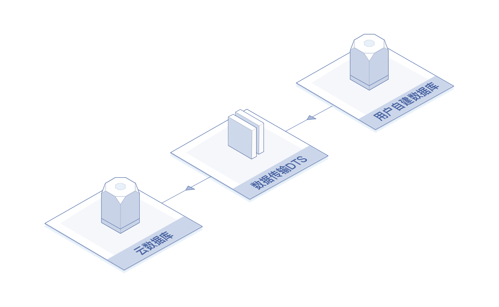
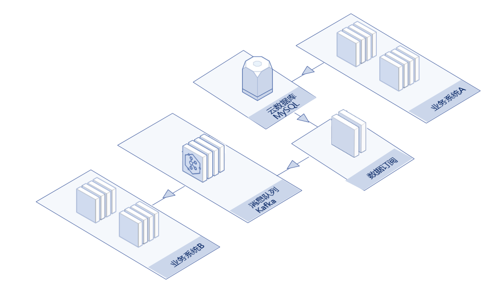
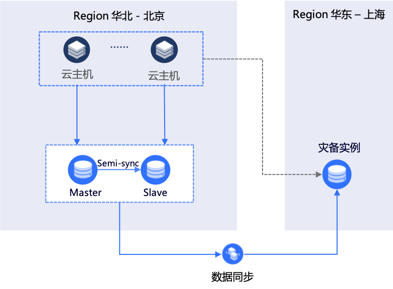

# 应用场景

以下说明数据传输 DTS 的使用场景。

## 数据迁移 - 数据热迁移上云

DTS 支持不停服数据迁移，迁移过程中持续获取源数据库的增量数据并更新到目标数据库，数据迁移期间不影响源数据库对外提供服务，从而最大程度地减少上云过程对业务的影响。

## 数据订阅 - 业务异步解耦

通过DTS提供的数据订阅服务，可以将深耦合的业务优化为通过实时消息通知实现的异步耦合，如：业务系统A完成数据写入后直接返回，底层通过DTS的数据订阅实时获取数据变更，业务系统B通过SDK订阅这些变更数据。

## 数据同步 - 异地灾备

如果业务部署在单可用区、单地域中，当该可用区、地域因电力、网络等不可抗因素失去通信时，将导致业务中断。

为避免可用区级别的故障导致服务不可用，可以构建异地灾备中心以提高服务可用性。灾备中心和业务中心的数据通过DTS实现实时同步，用以保障数据一致性。当业务中心故障时，可以直接将业务流量切换至灾备中心，快速恢复服务。

