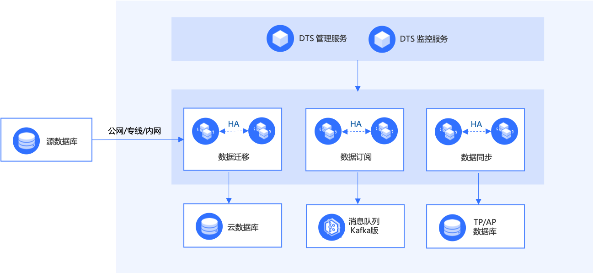
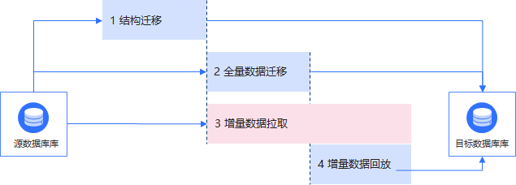

# 基础架构

## 业务架构

**说明**

- DTS管理服务：创建管理迁移任务，每个任务会对应创建一个DTS Kernel Agent。
- DTS监控服务：监控任务状态。
- DTS Kernel Agent：DTS迁移服务，用于执行数据迁移，以容器的形式部署在目标数据库所在的子网中，DTS Kernel Agent支持自动高可用。

## 数据迁移基本原理

**说明：**

- 数据迁移提供多种迁移类型：结构迁移、全量迁移和增量迁移。
- 结构迁移，迁移源数据库的库表结构。
- 全量迁移，迁移源数据库当前的全量数据集。
- 增量数据拉取，增量迁移服务将持续获取全量数据迁移过程中源数据库的变更数据。
- 全量数据迁移完成后，增量迁移服务持续获取源数据库变更，并回放到目标数据库。
