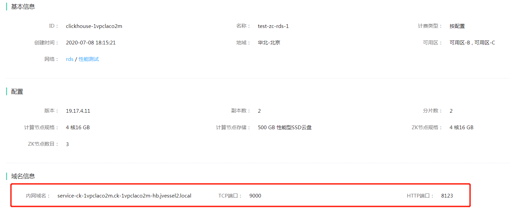

# 连接实例

1. 在实例列表页，点击要连接的实例名称，进入实例详情页
2. 在实例详情页面中，查看实例的域名及端口信息. JCHDB集群有两个端口，TCP端口和HTTP端口，可按需使用



3. 登录到与该实例在同一VPC中的云主机，安装下载客户端。 JCHDB使用clickhouse的客户端。
- Ubuntu 或 Debian
```
sudo apt-get install apt-transport-https ca-certificates dirmngr
sudo apt-key adv --keyserver hkp://keyserver.ubuntu.com:80 --recv E0C56BD4

echo "deb https://repo.clickhouse.tech/deb/stable/ main/" | sudo tee \
    /etc/apt/sources.list.d/clickhouse.list
sudo apt-get update

sudo apt-get install -y clickhouse-client
```

- Centos 或 Redhat
```
sudo yum install yum-utils
sudo rpm --import https://repo.clickhouse.tech/CLICKHOUSE-KEY.GPG
sudo yum-config-manager --add-repo https://repo.clickhouse.tech/rpm/clickhouse.repo
sudo yum install  clickhouse-client
```


4.  使用以下命令连接JCHDB实例
```
./clickhouse-client --host=<host> --port=<port> --user=<user> --password=<password>
```

参数说明：
- host：为步骤2中获得的实例的域名。
- port：为步骤2中获得的实例的TCP端口号
- user：连接的用户名，在控制台的“账号管理”页面中创建
- password：连接的密码，在控制台的“账号管理”页面中创建
