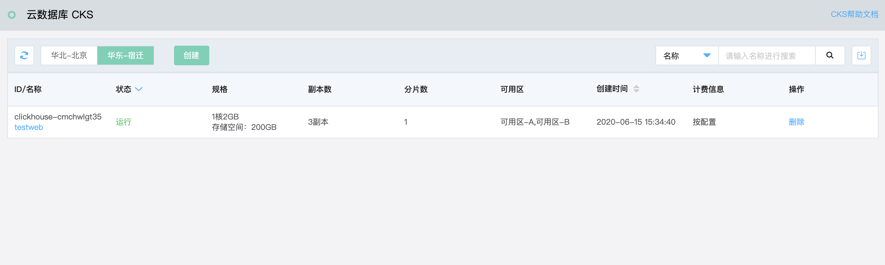
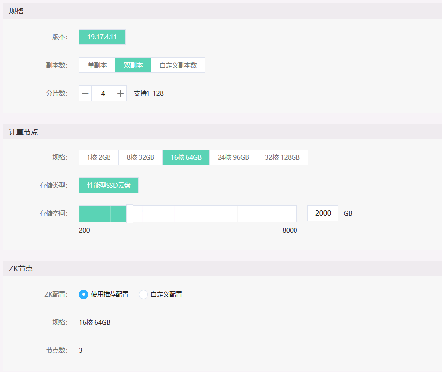
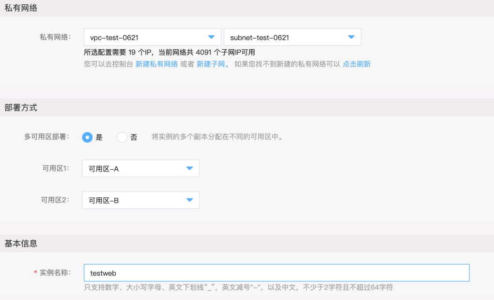
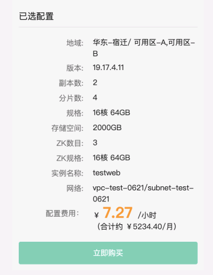

# 新建实例

#### 1. 进入实例列表页
当前页面会显示当前区域下的各个 JCHDB 实例的概要信息，包括计费信息和过期时间等。

点击 **【创建】** 按钮，新建一个 JCHDB 实例。

#### 2. 选择计费方式及地域
进入到数据库配置页面，选择计费方式（包年包月或按配置），地域，可看到当前地域上CPU核数的配额。 用户创建的实例的总核数不能超过当前地域下的剩余配额。 如果配额不足，可通过工单申请提升。

**注意：不同地域间的内网互不连通，建议选择最靠近您的地域，可降低访问时延、提高速度**

#### 3. 实例配置 
1）选择实例的版本，并设置副本数和分片数

2）设置单个计算节点的规格及存储空间

3）设置ZooKeeper节点的规格（ZK 的数目固定为3个）。 ZK的规格可以使用系统推荐值，系统会根据前面所选择的副本数和分片数动态进行调整；用户也可以自行设置ZK的规格。

#### 4. 网络，可用区及实例名称
1）JCHDB只支持在私有网络中创建。如果用户没有私有网络及子网，可以通过 **"新建私有网络”**和 **“新建子网”** 的链接创建私有网络和子网。创建完成后，点击**“刷新”**，就可以看到新创建的私有网络和子网了。

2）设置实例是单可用区部署还是多可用区部署。 只有副本数>=2的实例才能使用多可用区部署。

#### 5. 选择购买时长
如果是包年包月方式，请选择购买的时长。

#### 6. 确认购买

信息输入完成后，可查看点击页面右边的价格信息，并点击 **【立即购买】**

#### 6. 支付订单
然后进入订单确认页面，确认购买信息无误后，点击 **【立即支付】**

#### 7. 实例创建中
支付成功后自动返回实例列表页面，能看到实例状态为 **"创建中"**

#### 8. 创建完成
稍等一会后，点击 **【刷新】** 按钮，手工刷新页面，显示实例创建完成，显示 **“运行”** 中
