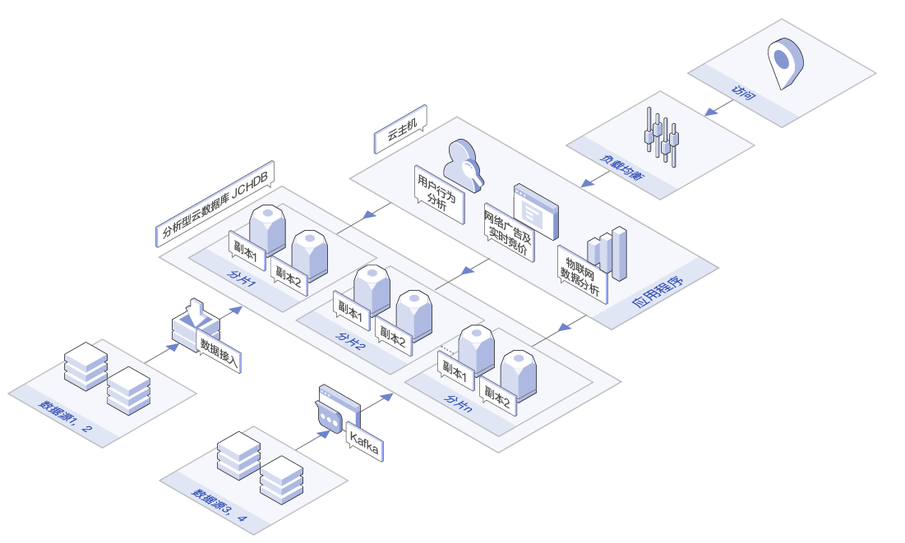
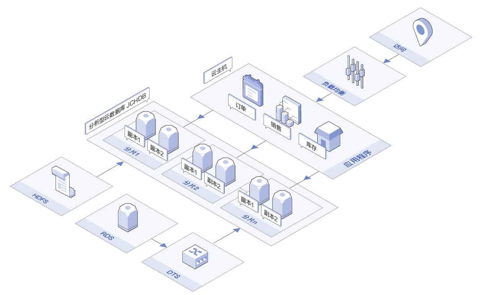

# 应用场景

## 数据在线分析
适合需要对海量数据进行在线分析的场景，例如用户行为分析、网络广告及其实时竞价，以及一些物联网场景中对数据库进行准实时的在线分析处理等。 分析型云数据库 ClickHouse对SQL有良好的支持，其卓越的查询性能可满足业务系统对数据库准实时分析能力的需求。

## BI报表
适合各种BI分析及数据报表的场景。分析型云数据库 ClickHouse具有高效的压缩算法和杰出的并行查询能力，能够在海量数据的业务场景下快速响应业务的分析需求。

