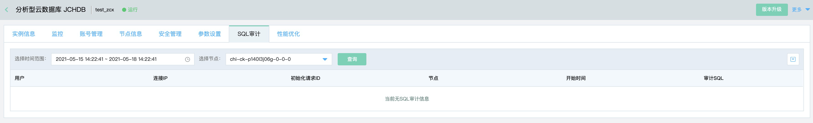

# JCHDB 审计服务
分析型云数据库 JCHDB 提供日志审计功能，会统计所有 DML 和 DDL 操作信息。
SQL 审计不会解析实际的参数值，并且在 SQL 查询量较大的时候会丢失少量的记录。因此通过这种方式来统计准确的增量数据可能会出现不准确的情况。

## 操作步骤
1. 登录[分析型云数据库 JCHDB 管理控制台](https://jchdb-console.jdcloud.com)。  
2. 选择需要查询 SQL 审计的目标实例，点击目标实例， 进入实例详情页，切换至 ***SQL 审计*** Tab 页，SQL 审计查询功能说明如下。  
    * 执行时间：可以选择从当前时间往前推 7 天的时间区间，作为 SQL 审计查询的时间段。
    * 选择节点：可以查看指定节点的审计信息。
   

    

3. 点击 ***查询*** 按钮，查看符合要求的 SQL 列表。
