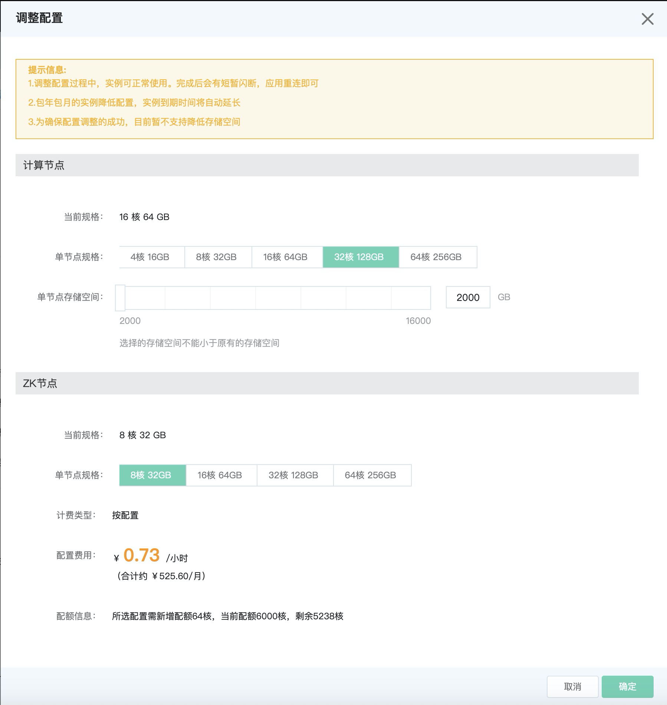

# 变更配置
在使用分析型云数据库ClickHouse过程中，如果需要修改实例配置，可以通过分析型云数据库ClickHouse管理控制台设置。 

## 操作步骤
1. 登录[分析型云数据库ClickHouse管理控制台]（https://jchdb-console.jdcloud.com）。
2. 选择需要修改配置的目标实例，点击目标实例，进入实例详情页。
3. 点击 ***调整配置 *** ，弹出框参数说明如下:
    * 计算节点：支持单节点规格扩大或缩小，若没有选择新规格，则当前规格不变；
    * ZK节点：支持ZK节点扩大或缩小，若没有选择新规格，则当前规格不变；
    * 存储空间：支持存储空间增加，若没有增加存储空间，则当前配置置灰不变；

4. 点击 ***确定*** 按钮，完成配置修改。

