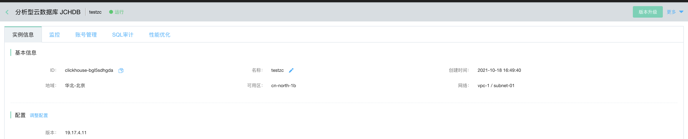
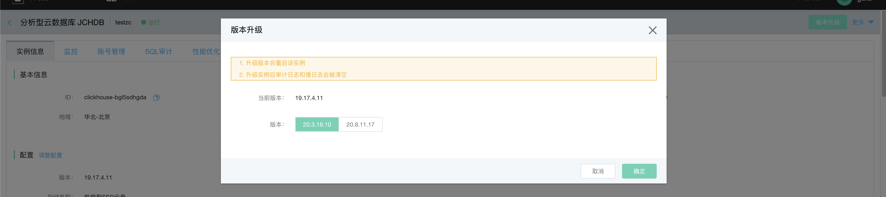

# 实例版本升级
提JCHDB内核版本升级的功能，例如从19.17.4.11升级到20.3.18.10，支持升级到比当前版本更高的版本号
## 注意事项
* 只有实例状态为 **运行** 状态时，可进行版本升级。。
* 若实例当前版本已经是最新版本，则版本不可升级

## 操作步骤
1. 登录[分析型云数据库 JCHDB 管理控制台]（https://jchdb-console.jdcloud.com]。
2. 在实例列表页， 选择需要版本升级的目标实例，进入到目标实例详情页，点击页面右上角的 **操作 - 版本升级**，进入实例升级弹窗。
3. 实例升级的参数说明如下：
- 当前版本：实例当前版本号
- 升级版本：实例升级后版本号，支持升级到比当前版本更高的版本号

4. 点击 **确认** 实例进行版本升级。
5. 实例升级成功，页面右上角会有浮层提示，2秒后自动消失，提示内容为：实例升级成功，请手动刷新页面；实例详情页的状态字段刷新，页面变成可以编辑状态。
