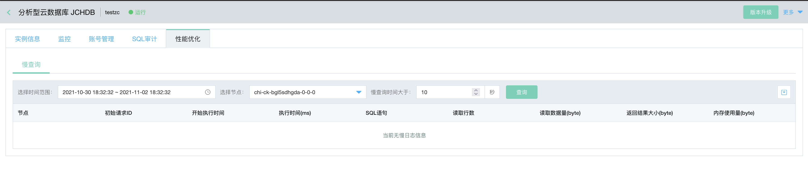

# 慢日志 
分析型云数据库ClickHouse提供提供了慢日志功能，可以查看慢查询情况和慢查询优化。

## 操作步骤

### 查看慢日志
1. 登录[分析型云数据库ClickHouse 管理控制台]（https://jchdb-console.jdcloud.com/list）。
2. 选择目标实例，点击目标实例，进入实例详情页 。  
3. 点击 **性能优化** Tab 页， 选择时间范围，选择需要查询的ZK节点和计算节点，输入慢查询时间（默认慢查询时间大于10秒），慢查询功能说明如下。

    * 执行时间：可以选择从当前时间往前推 7 天的时间区间，作为 慢SQL 查询的时间段。
    * 选择节点：可以查看指定节点的审计信息。
    * 读取行数：参与查询的所有表和表函数中读取的行总数。
    * 读取数据量：参与查询的所有表和表函数中读取的总字节数。
    * 返回结果大小：用于存储查询结果的RAM容量(以字节为单位)。
    * 内存使用量：查询所消耗的内存。
  
4. 点击 ***查询*** 按钮，查看符合要求的 SQL 列表。

