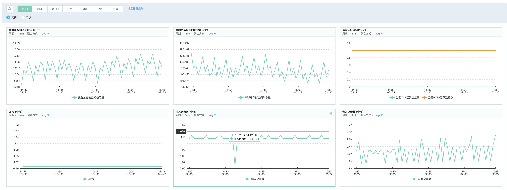

# 查看监控信息
在控制台上，您可以查看多项分析型云数据库ClickHouse 实例和实例下各节点监控指标，通过指标数据，您可以定位系统的问题所在，进行相应的系统优化。

## 操作步骤
1. 登录 [分析型云数据库ClickHouse管理控制台](https://jchdb-console.jdcloud.com)。
2. 选择需要查看监控信息的目标实例，点击目标实例，进入实例详情页。
3. 选择 ***监控*** 标签，查看云数据库监控项，如下图所示。

   
   
4. 默认显示的是 1小时 维度的监控数据，同时您也可以选择 6小时，12小时，1天，3天，7天，14天 维度，如果需要看 30天 内的监控数据，可以通过选择日期范围来查看。
## JCHDB 监控项
### 实例监控项
|监控项|说明|监控频率|监控周期|
|---|---|---|---|
|集群总存储空间使用量|实例的硬盘空间的总使用量，包括用户数据使用量和日志文件使用量。单位：GB|60 秒/次|30 天|
|集群总存储空间剩余量|实例的硬盘空间的总剩余量，包括用户数据使用量和日志文件使用量。单位：GB|60 秒/次|30 天|
|当前活跃连接数|实例总活跃连接数。单位：个|60 秒/次|30 天|
|QPS|每秒处理的查询数目。单位：个|60 秒/次|30 天|
|插入记录数|实例每秒插入记录的总行数。单位：个|60 秒/次|30 天|
|合并记录数|实例每秒合并记录的总行数。单位：个|60 秒/次|30 天|
|复制job数|实例复制队列任务总数，包括check、fetch、send。单位：个|60 秒/次|30 天|
|Zookeeper请求数|实例当前zookeeper请求总数。单位：个|60 秒/次|30 天|

### 节点监控项
|监控项|说明|监控频率|监控周期|
|---|---|---|--|
|CPU 利用率|实例节点的 CPU 使用率。单位：GB|60 秒/次|30 天|
|内存使用率|实例节点的内存使用率。单位：GB|60 秒/次|30 天|
|磁盘使用量|实例节点的磁盘空间使用量，包括用户数据使用量和日志文件使用量。单位：GB|60 秒/次|30 天|
|网络进/出速率|实例节点每秒钟的接收、发送流量。单位：Kbps|60 秒/次|30 天|
|网络进/出数据包|实例节点每秒钟的接收、发送数据包的个数。单位：个|60 秒/次|30 天|
|磁盘读/写吞吐量|实例节点的磁盘读取/写入数据量。单位：GB|60 秒/次|30 天|
|磁盘读/写IOPS|实例节点每秒读取/写入IOP数。单位：个|60 秒/次|30 天|
