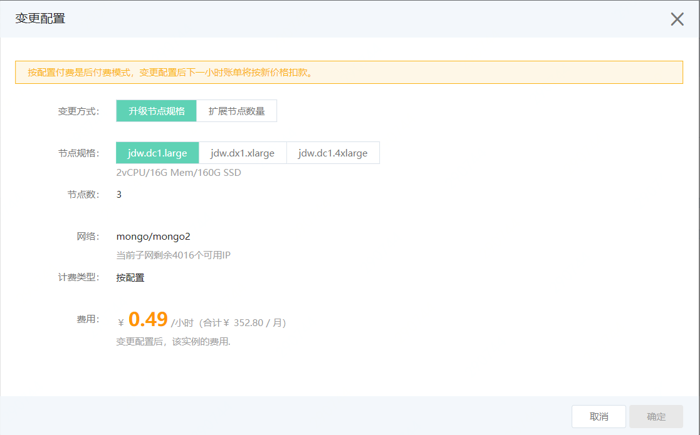
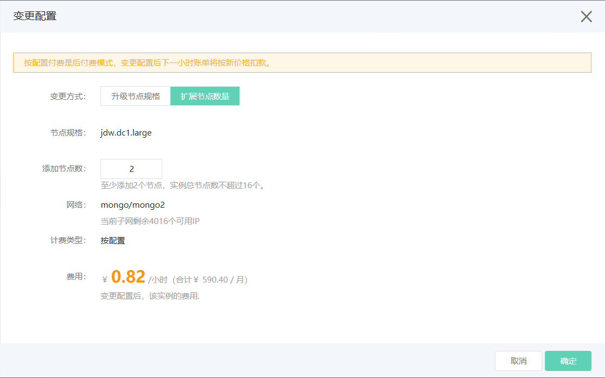

# 变更实例配置

如果当前JDW实例的配置不能满足业务要求，您可以需要变更实例配置，JDW实例支持升级节点规格和扩展节点数量。

## 注意事项

- 变更配置过程中会出现闪断、主从切换等情况，建议在业务低峰期执行此操作，且确保应用程序有重试机制。
- 变更配置所需时间与数据量和节点数量相关，通常在几分钟至数小时内可完成。

## 操作步骤

1. 登录 [JDW 控制台](https://jdw-console.jdcloud.com/list)。

2. 在实例列表页面或实例详情页，点击**变更配置**，打开变更配置弹窗。

3. 变更配置支持升级节点规格和扩展节点数量。

   - 升级节点规格

     
     
     变更方式：选择**升级节点规格**
   
     节点规格：选择高于当前配置的规格。
   
     费用：付费类型为按配置时，费用为变更配置后，该实例的费用；付费类型为包年包月时，费用为变更配置后需支付的差价。
   
   - 扩展节点数量

     
   
     变更方式：选择**扩展节点数量**。
     
     添加节点数：当前实例要增加的Segment节点数量，一次变配至少需添加2个节点，实例总节点数不超过16个。
     
     费用：付费类型为按配置时，费用为变更配置后，该实例的费用；付费类型为包年包月时，费用为变更配置后需支付的差价。
   
4. 点击**确定**后，开始执行变更配置，实例状态变更为“变更配置中”，等待变配操作完成。
   
   
   
   

