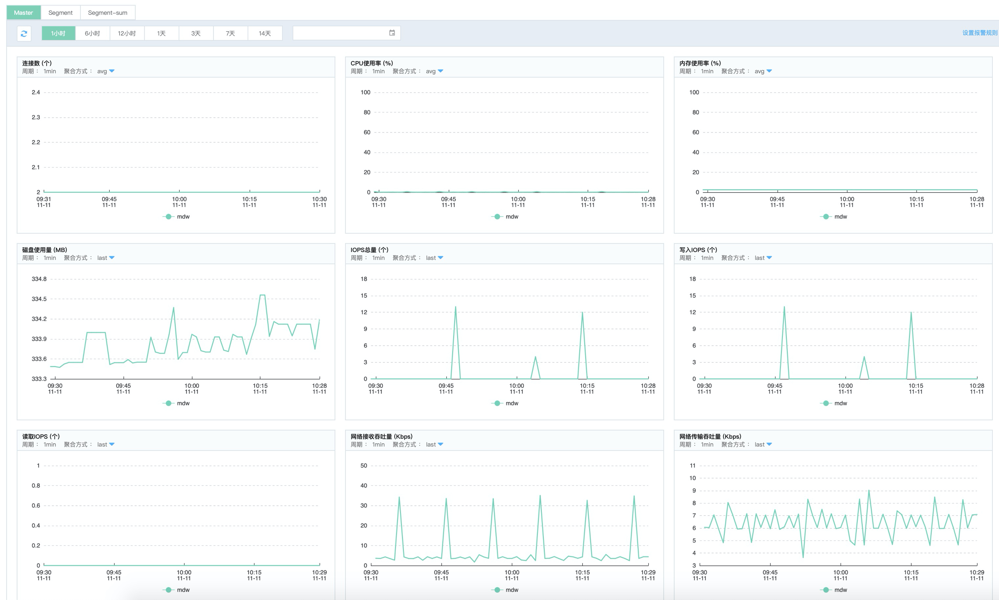

# 查看监控信息

JDW 控制台提供了丰富的性能监控数据，您可以随时查看实例的运行状态。

## 操作步骤

1. 登录 [JDW 控制台](https://jdw-console.jdcloud.com/list)。

2. 在实例列表页，选择目标实例，点击**实例名称**，进入实例详情页。

3. 在实例详情页，点击**监控**，查看监控信息。

   

- 支持查看Master节点、Segment各个节点以及Segment所有节点的监控信息。
- 支持查看各节点监控指标在指定监控周期数据聚合结果，包括最大值、最小值、平均值、求和以及最新上报的监控值。
- 您可以快速选择查看1小时至14天的监控数据，也可以输入日期范围查看，时间范围最长可选择1个月。
