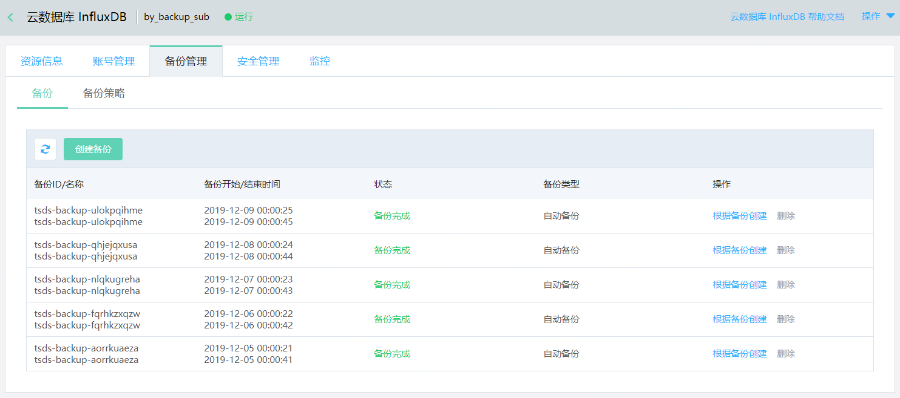
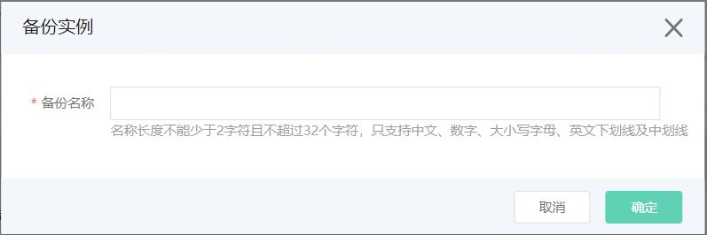

# 手动创建备份

每个用户默认可创建5个 InfluxDB 备份，备份文件长期保存，暂不收取任何费用。

## 注意事项

- 如当前有进行中的备份任务，则此时不能再次发起创建备份任务。

## 操作步骤

1. 登录  [InfluxDB控制台](http://tsds-console.jdcloud.com/list)。

2. 在“实例列表”页面，选择目标实例，点击 **实例名称**，进入“实例详情”页面。

3. 在“实例详情”页面，依次点击 **备份管理**  >  **备份** ，进入“备份”页面。

   

4. 在“备份”页面，点击 **创建备份**，打开“备份实例”弹窗。

   

   - 填写备份名称。

   - 点击 **确定**，确定创建备份。

5. 您可以在“备份列表”中查看备份状态，如果备份状态变更为“备份完成”，表示备份创建成功。

