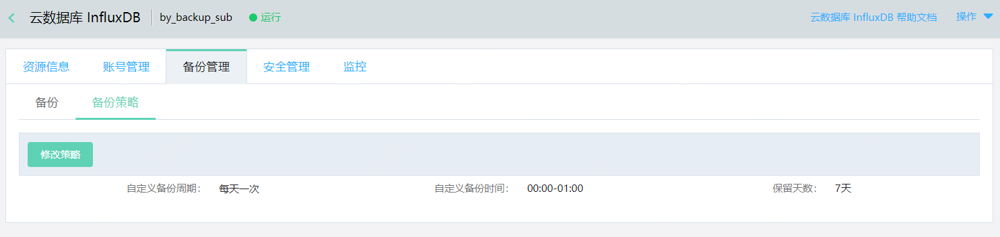
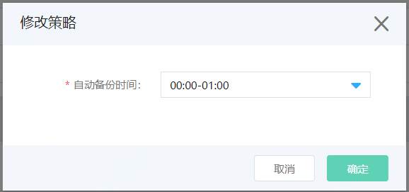

# 设置自动备份

云数据库 InfluxDB 支持自动备份，默认备份开始时间为每天的0:00-1:00，您可以根据业务情况调整自动备份时间。

## 注意事项
- 自动备份文件默认保留7天，不支持手动删除。
- 如当天已执行自动备份，修改自动备份时间在当前时间之后，仍会创建备份。

## 操作步骤
1. 登录  [InfluxDB控制台](http://tsds-console.jdcloud.com/list)。

2. 在“实例列表”页面，选择目标实例，点击 **实例名称**，进入“实例详情”页面。

1. 在“实例详情”页面，依次点击 **备份管理** >  **备份策略**，进入“备份策略”页面。

    

4. 在“备份策略”页面，点击 **修改策略**，打开“修改策略”弹窗。

    

     - 在“修改策略弹窗”，重新选择期望的自动备份时间。
     - 点击 **确定**，保存修改。
     - 您可以在“备份策略”页面查看修改结果。

