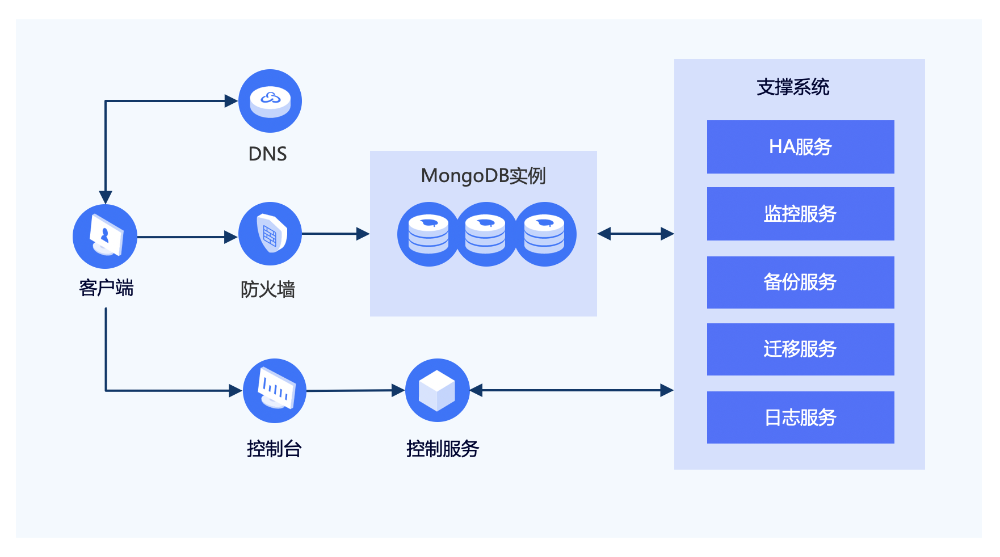

# 基础架构

云数据库 MongoDB 支持副本集与分片集群两种部署方式，默认提供高可用架构。

## 业务架构
业务架构如下图：

| 名称     | 描述                                                         |
| -------- | ------------------------------------------------------------ |
| 控制服务 | 支持 MongoDB 实例的多种管理控制任务，包括创建、删除、查询、配置变更、容灾切换、备份与恢复等任务。 |
| HA服务   | Sentinel 监控 MongoDB 实例是否存活，多个哨兵同时工作，当发现节点不可用时，发送 failover 任务，自动创建新节点，并同步数据。 |
| 监控服务 | 收集 MongoDB 实例信息（资源使用和数据库键统计信息等）和物理机信息（资源使用信息和评分等），前者供用户和控制台展现，后者用于系统管理。 |
| 备份服务 | 自动定时备份，以及支持用户手动创建备份。                     |
| 迁移服务 | 当主从节点都不可用的时候，或者需要克隆在线运行的实例时，在线迁移系统负责实例重新搭建及数据迁移任务，保证业务不受影响。 |
| 日志服务 | 收集 MongoDB 实例的运行情况的日志信息。                      |

## 相关参考

- [产品优势](../Introduction/Benefits.md)
- [产品功能](../Introduction/Features.md)
- [价格总览](../Pricing/Price-Overview.md)
- [计费规则](../Pricing/Billing-Rules.md)
- [创建实例](../Getting-Started/Create-Instance.md)
