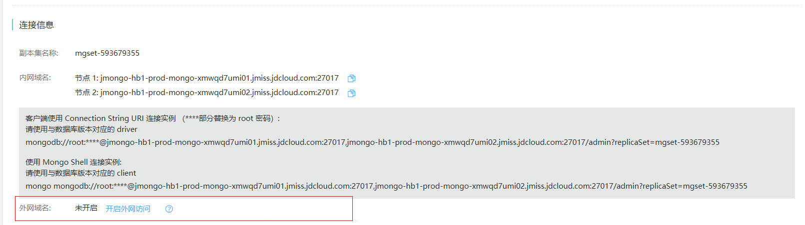
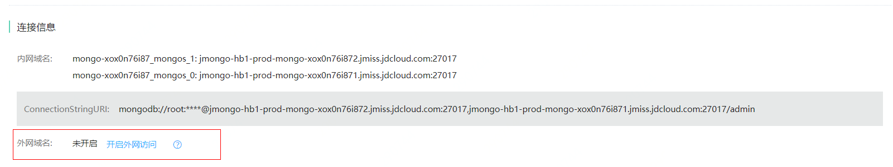
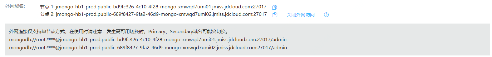
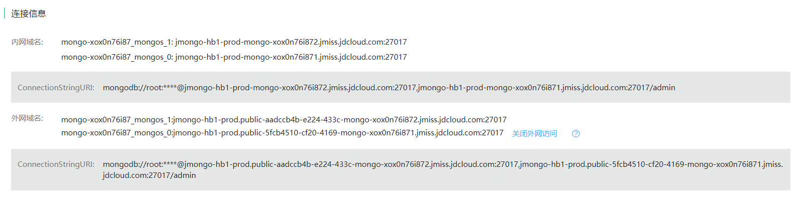

# 外网访问

MongoDB实例默认不开启外网访问，如您的业务需要，可手动开启外网访问。

**为确保连接安全，务必设置白名单以限制访问源。**

## 注意事项

- 由于外网域名生效需要一定时间，请耐心等待3~5分钟。
- 如果关闭了外网访问，下次再次开启外网访问，访问地址会发生变化。
- 副本集实例目前不支持URI方式连接，仅支持单节点连接，在使用时请注意区分Primary、Secondary。

## 操作步骤

1. 登录 [MongoDB 控制台]( https://mongodb-console.jdcloud.com/mongodb )。

2. 在“实例列表”页面，选择目标实例，点击 **实例名称** ，进入实例详情页面。

3. 在连接信息模块，点击**开启外网访问**，打开确认弹窗。

   - 副本集：

     

   - 分片集群：

     

4. 在确认弹窗中，点击**确定**，开启外网访问。

5. 开启完成后，可在连接信息处查看。

   - 副本集

     

   - 分片集群

     

6. 创建的外网域名将展示在连接信息模块，如不再需要，可点击**关闭外网域名**。

   
