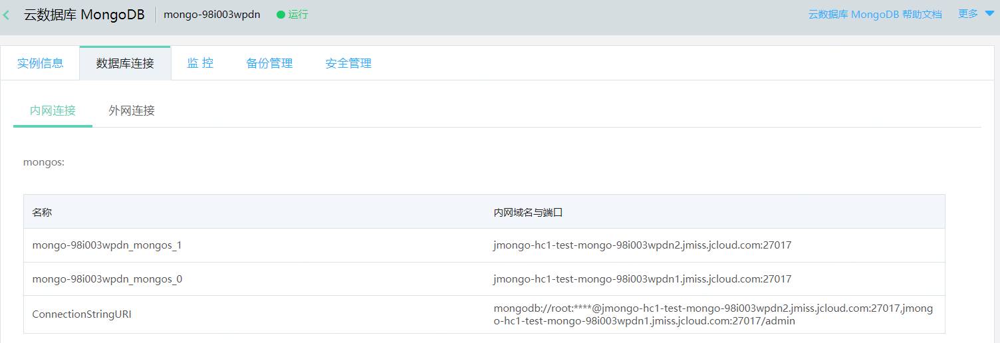
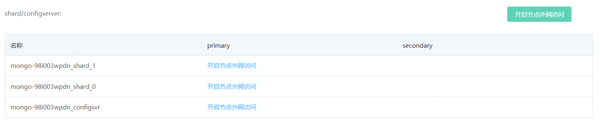
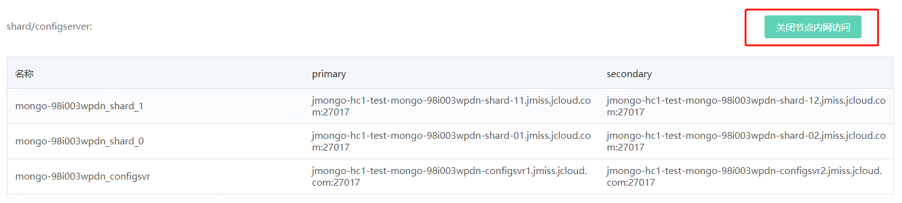

# 节点域名管理

分片集群实例由mongos、shard和configserver三种节点组成，一般业务读写数据只需连接至mongos节点即可。

在某些特定场景下，如按分片导入导出数据时，可开启shard/configserver节点域名，以满足业务需求。

## 前提条件

1. 实例类型为分片集群。
2. 当前实例未欠费，且状态为“运行”。

## 使用须知

1. 节点域名临时用于数据迁移等场景，务必避免直接连接写入数据，使用完毕后请及时释放，以免发生误操作。
2. shard/configserver节点域名仅适用于单节点连接方式，使用时请注意区分Primary、Secondary。

## 操作步骤

1. 登录 [MongoDB 控制台](https://mongodb-console.jdcloud.com/mongodb)。

2. 在“实例列表”页面，选择目标实例，进入实例详情页面。

3. 在"实例详情页"点击“数据库连接”，打开数据库连接管理页。

4. 在数据库连接管理页面，选择**内网连接**或**外网连接**，可查看当前分片集群各类型节点的连接信息。

   

5. 在shard/configserver模块右侧，点击按钮**开启节点内网访问**或**开启节点外网访问**，可开启当前实例全部shard/configserver节点的域名，对新增加的节点，如未开启内/外网域名，可按节点开启域名。

   

6. 开启节点域名时，如当前节点无账号密码，则需要填写用于管理节点的账号密码，请牢记填写的账号密码。

   

7. 如需释放域名，请在当前页面点击**关闭节点内网访问**或**关闭节点外网访问**。

   

   

   
