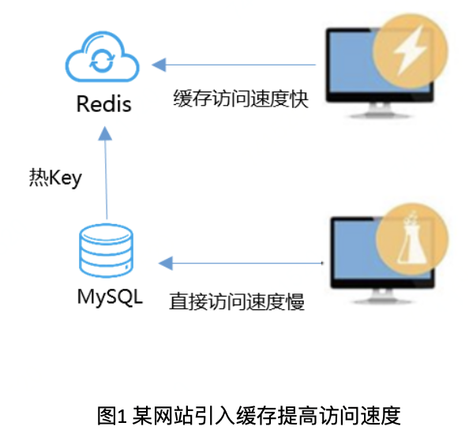
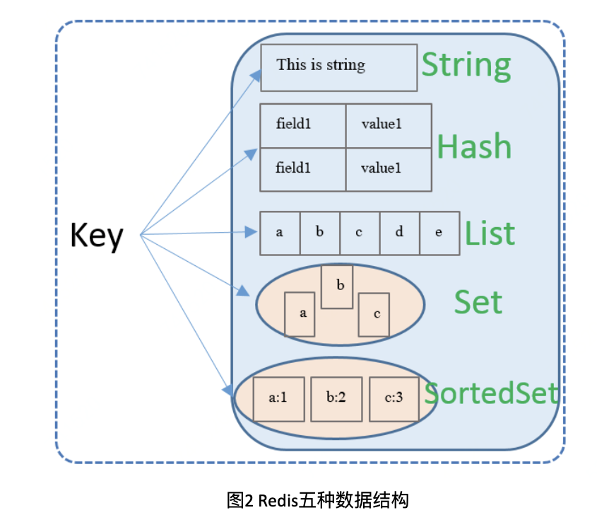
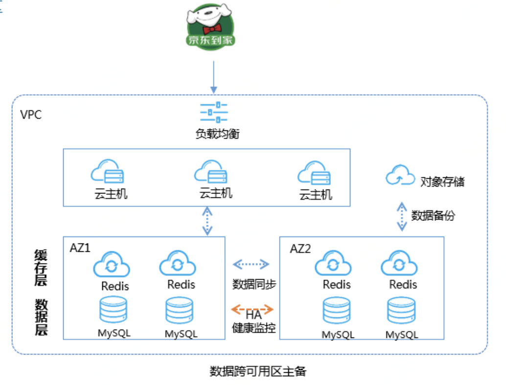

# 高并发场景下的数据访问速度如何保障？

缓存Redis已成为高并发场景下提升数据访问速度的标配。大多数企业都会面临大量并发读写数据时访问速度慢、数据库压力大的问题，Redis起到了降低数据库压力，提升数据访问速度的作用。下图是某网站业务的解决访问速度慢的问题，引入缓存Redis提升访问速度的流程：

##    Redis 是什么？

Redis（Remote Dictionary Server）是意大利人开发的一款内存高速缓存数据库，由C语言编写而成，是典型的NoSQL数据库，号称世界上最快的数据库之一。有如下特点：

 - 支持多种数据结构，支持如下图所示的五种数据结构
 - 

 - 读写速度快、性能高，由于数据都存在内存中，非SSD或者HDD等存储介质，内存型数据库的最大特点就是性能高、响应时间极低

 - 持久化到硬盘上(Redis 提供了两种持久化方式:RDB 和 AOF)，即使断点或机器故障时，内存数据不会丢失，保证了数据的高可靠

 - 高可用和分布式，提供哨兵机制保证服务高可用，不同节点保障分布式部署

 - 多语言客户端，支持Java、PHP、Python、C、C++、Nodejs等

 - 丰富的功能，键过期、发布订阅实现消息系统等

 - 支持事务原子性，即操作数据要么全部成功，要么全部失败

##    云上缓存Redis概况

各大云厂商都已纷纷推出云上缓存服务，云上缓存Redis在开源Redis基础上，除了单实例架构（无高可用性），大部分厂商增加了Proxy代理，更方便的对Redis实例进行管理运维，控制台可对实例便捷管理及可视化监控。京东智联云云缓存Redis在各行业积累了丰富的行业经验，目前已为各行业龙头公司提供稳定的高性能缓存服务。

一般客户业务系统使用云缓存Redis后，相比传统自建机房、自己搭建维护Redis集群千万级别的投入，成本能大幅度降低。使用云缓存Redis前期投入少，每年的云上费用也比自建维护费以及租金少一个数量级；同时云缓存Redis可拓展性更高，可以随着公司业务量和场景的变化随时扩缩容或新增购买，周期时间短；更重要的一点是，云上缓存Redis横向扩展能力很强、速度快，随时保证高性能应对海量高并发读写，而传统缓存数据库高压读写时容易崩溃。

##   京东智联云云缓存 Redis 助力“京东到家” 

达达快送是达达集团旗下中国领先的本地即时配送平台，为各类商家和个人用户提供专业高效的本地即时配送服务。截至2020年一季度，达达快送业务覆盖全国2400多个县区市，日单量峰值达千万级。

京东到家是达达集团旗下中国领先的本地即时零售平台。京东到家携手零售商和品牌商等合作伙伴，依托达达快送的全国即时配送网络，为消费者提供超市便利、生鲜果蔬、医药健康、鲜花蛋糕、烘焙茶点、家居时尚等海量商品约1小时配送到家的服务体验。截至2020年一季度，京东到家业务覆盖全国700多个县区市，年度活跃门店数近10万。

作为典型的电商，京东到家的缓存需求为：

  1.读写高性能、低时延；

  2.缓存数据持久化存储，保证服务高可用；

  3.定期备份数据，可按需恢复；

  4.监控报警服务，超过阈值的监控会及时通知；

  5.提供大容量缓存实例、促销时能快速平滑扩容；

  6.提供数据迁移上云服务，支撑用户前期数据的迁移上云；

  7.定期缓存分析，查看访问命令、大key热key情况，便于调整缓存数据存取策略。

京东云缓存 Redis 给京东到家购物车系统、签到系统等提供了强大稳定的缓存服务。在满足客户所提需求之外，京东智联云云缓存 Redis 还提供了24小时技术支撑服务，应对各种突发事件，已经历过618、双11、双12大促考验。

那云缓存Redis又是如何解决以上需求的呢？

数据迁移上云：用户把数据从自建Redis迁移到云缓存Redis，使用迁移工具，支持不停服双写迁移

  - 备份恢复：定期备份，用户数据需要持久化并保证数据的可靠性

  - 备份下载：为了防止数据丢失，7天外的数据需要提前下载到本地

  - 参数修改：客户需要修改Redis的一些参数配置，可通过参数修改功能实现

  - 按需扩容：随着客户的数据量越来越大，开通的实例容量需要平滑扩容

  - 监控报警：设置报警策略，触发阈值时及时电话邮件通知，方便随时查看处理

  - 缓存分析：可定时缓存分析，查看TOP命令、大key热key和key类型分布，根据分析调整缓存策略

达达618期间迎战巨大的物流配送挑战，保障了末端“最后3公里”的高效履约。在这张覆盖全国上千县市、数十万配送员的强大运力网络背后，京东智联云云缓存 Redis 有效地保障了达达系统的稳定性和高效性。

在此次京东 618 大促期间，京东智联云云缓存 Redis 支撑了京东物流仓储管理、供应链、大件物流开放平台等核心系统，和京东到家的签到、秒杀、红包等多个系统的数据存储和访问需求。

