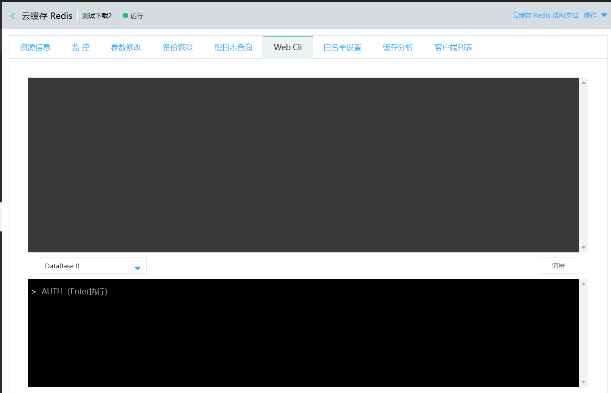

# 连接实例

云缓存Redis支持如下连接方式：控制台WebCLi连接、京东云主机Redis-cli连接、通过SDK 连接。由于云数据库 Redis提供的数据库服务与原生的数据库服务完全兼容，连接数据库的方式也基本类似。任何兼容 Redis 协议的客户端都可以访问云数据库 Redis服务，用户可以根据自身应用特点选用任何 Redis 客户端。

##  网络连接
|  网络连接  |  说明  |  
| :--- | :---  | 
|  内网连接	|  云缓存Redis实例仅支持通过京东云内网连接。京东云内其它产品与其连接则需要与云缓存Redis在相同地域、相同VPC内。|  
|  公网连接	|  目前暂不支持直接公网访问，但可通过云主机代理转发方式连接实例。具体请见:  [公网链接Redis实例](../Operation-Guide/Connect/ConnectInstance.md)  |  

##  连接方式

###  控制台WebCli连接

当实例处于“运行中”状态时，才能在控制台上使用WebCli。操作步骤如下：

1、登录云数据Redis控制台，选择要登录的实例，进入实例详情页。

2、进入Web Cli 菜单，使用密码登录和操作实例。

**注意：**  使用Web-cli连接实例前提为：该实例已设置密码，免密无法使用Web-cli。为安全起见请关闭免密，设置密码后再使用Redis Web Cli。 

###  云原生工具redis-cli

redis-cli是原生Redis自带的命令行工具，使用可参考：https://redis.io/topics/rediscli

京东云缓存Redis仅支持京东云VPC访问，即只有在相同VPC中的云主机上安装Redis，才能使用redis-cli与云缓存Redis建立连接并进行数据操作。===========使用详情请参考： redis-cli连接Redis 

###  通过SDK连接
关于Redis支持的客户端列表，请参见[Redis Clients](http://redis.io/clients)。目前云缓存Redis提供如下多语言示例：

===============================
03-C/C++连接
04-Golang连接
05-Java连接
06-PHP连接
07-Python连接
08-Node.js连接

##  测试连通性

请使用标准的redis-cli工具测试连通性，并使用以下命令查看是否连通。注意，Redis 4.0请用这个方法测试连通性，不能直接发送ping命令测试

    redis-cli -h [host] ping
   
    

