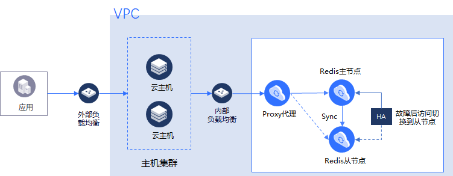
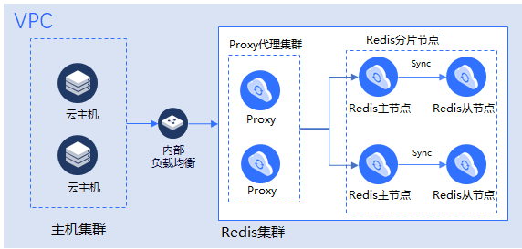

# 产品规格

## 标准版

###  标准版架构图

###  标准版Redis4.0规格

| 规格 |  规格代码 （API 使用）  | 分片数	  | 最大连接数（个）   | 内网带宽上限（MB/s）  |
| :--- | :---  |:---  |:---  |:---  |			
|  1G	|  redis.m.micro.basic	|  1		|  10000	|  	48	|  
|  2G |  	redis.m.small.basic|  	1	|  	10000	|  	48	|  
|  4G	|  redis.m.medium.basic	|  	1	|  	10000	|  	48	|  
|  8G	|  redis.m.large.basic		|  1		|  10000	|  	48	|  
|  16G	|  redis.m.xlarge.basic		|  1	|  	10000	|  	48	|  
|  32G	|  redis.m.2xlarge.basic	|  	1	|  	10000		|  48	|  

## 集群版

###  集群版架构图

###  集群版Redis4.0规格

| 规格 |  规格代码 （API 使用）  | 分片数	  | 最大连接数（个）   | 内网带宽上限（MB/s）  |
| :--- | :---  |:---  |:---  |:---  |			
|  4G集群版（2分片）|  	redis.s.small.basic    |    2   |   	20000   |   	96   |   
|  8G集群版（2分片）|  	redis.s.medium.basic   |   2	   |   20000	   |   96   |   
|  16G集群版（2分片）|  	redis.s.large.basic   |   	2	   |   20000   |   	96   |   
|  32G集群版（2分片）|  	redis.s.xlarge.basic   |   2	   |   20000   |   	96   |   
|  64G集群版（2分片）|  	redis.s.2xlarge.basic   |   2	   |   20000   |   	96   |   
|  8G集群版（4分片）	|  redis.s.small.basic   |    4	   |   40000	   |   192   |   
|  16G集群版（4分片）|  	redis.s.medium.basic   |   	4	   |   40000   |   	192   |   
|  32G集群版（4分片）|  	redis.s.large.basic   |   	4	   |   40000   |   	192   |   
|  64G集群版（4分片）|  	redis.s.xlarge.basic   |   	4	   |   40000   |   	192   |   
|  128G集群版（4分片）|  	redis.s.2xlarge.basic   | 4	   |   40000   |   	192   |   
|  16G集群版（8分片）|  	redis.s.small.basic   |     8	   |   80000   |   	384   |   
|  32G集群版（8分片）|  	redis.s.medium.basic   |     8   |   	80000   |   	384   |   
|  64G集群版（8分片）|  	redis.s.large.basic   |   	8   |   	80000   |   	384   |   
|  128G集群版（8分片）|  	redis.s.xlarge.basic   | 	8	   |   80000   |   	384   |   
|  256G集群版（8分片）|  	redis.s.2xlarge.basic   |   	8   |   	80000   |   	384   |   
|  32G集群版（16分片）|  	redis.s.small.basic   |   	16   |   	160000   |   	768   |   
|  64G集群版（16分片）|  	redis.s.medium.basic   |   	16   |   	160000   |   	768   |   
|  128G集群版（16分片）|  	redis.s.large.basic   |   	16   |   	160000   |   	768   |   
|  256G集群版（16分片）|  	redis.s.xlarge.basic   |   	16   |   	160000   |   	768   |   
|  64G集群版（32分片）|  	redis.s.small.basic32   |   32   |   	320000   |   	1536   |   
|  128G集群版（32分片）|  	redis.s.medium.basic    |   32   |   	320000   |   	1536   |   
|  256G集群版（32分片）|  	redis.s.large.basic	    |   32   |   	320000   |   	1536   |   
|  512G集群版（32分片）|  	redis.s.xlarge.basic    |    32   |   	320000   |   	1536   |   
|  1024集群版（32分片）|  	redis.s.2xlarge.basic   |    32   |   	320000   |   	1536   |   
|  128集群版（64分片）|  	redis.s.small.basic	   |   64   |   	640000   |   	3072   |   
|  256集群版（64分片）|  	redis.s.medium.basic   |   	64   |   	640000   |   	3072   |   
|  512集群版（64分片）|  	redis.s.large.basic    |   	64   |   	640000   |   	3072   |   
|  1024集群版（64分片）|  	redis.s.xlarge.basic   |   	64   |   	640000   |   	3072   |   
|  2048集群版（64分片）|  	redis.s.2xlarge.basic   |   	64   |   	640000   |   	3072   |   
|  2048集群版（128分片）|  	redis.s.xlarge.basic   |   	128   |   	1280000   |   	6144   |   
|  4096集群版（128分片）|  	redis.s.2xlarge.basic   |   	128   |   	1280000   |   	6144   |   

## Redis 2.8（即将下线）
|  规格|规格代码|分片数|说明  |  
|  :---  |  :--|:---|:---|  
|  1G标准版|redis.m1.micro.basic|1|标准实例，可选  |  
|  2G标准版|redis.m1.small.basic	|1|标准实例，可选  |  
|  4G标准版|redis.m1.medium.basic|1|标准实例，可选  |  
|  8G标准版|redis.m1.large.basic	|1|标准实例，可选  |  
|  16G标准版|redis.m1.xlarge.basic|	1|标准实例，可选  |  
|  32G标准版|redis.m1.2xlarge.basic|	1|标准实例，可选  |  
|  16G集群版|redis.c1.small.basic|8|基础版集群实例，可选  |  
|  32G集群版|redis.c1.medium.basic|8|基础版集群实例，可选  |  
|  64G集群版|redis.c1.large.basic|8|基础版集群实例，可选  |  
|  128G集群版|redis.c1.xlarge.basic|16|基础版集群实例，可选  |  
|  256G集群版|redis.c1.2xlarge.basic|16|基础版集群实例，可选  |  
|  512G集群版|redis.c1.4xlarge.basic|32|基础版集群实例，可选    |  

#  常见问题
**Q：规划购买云Redis资源时，需要考虑从副本的容量吗？**

A：不需要，您规划的主副本是多大规格集群，则在云Redis上购买多大规格集群。云Redis的标准版、集群版均默认为1主1从架构，比如主副本使用16G集群版，则从副本也为16G集群版。

**Q：标准版可以升级为集群版吗？**

A：标准版可以升级为集群版，但集群版不支持改为标准版。

