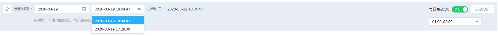

# 缓存分析

缓存分析是指对实例进行访问分析，用户可根据分析结果进行性能调优。

用户可在控制台设置每日自动分析时间，也可以实时进行手动分析。分析过程所需时长取决于用户Key的多少，请勿在分析过程中进行其他操作，以防分析失败。缓存分析只保留一个月内的数据，每天最多支持分析12次。

##  自动分析

1.	登录 [Redis 控制台](https://redis-console.jdcloud.com/redis)

2.	选择目标实例，点击实例名称进入实例详情页面

3.	点击“缓存分析”页签，进入缓存分析页面

4.	可以开启自动分析按钮，下拉选择时间段。

 
 
 
 ##  手动分析
 
您也可以点击手动分析，马上进行缓存分析，分析所耗时长将取决于Key数量。
 

 
 
**注意：**

-  因版本不同，Redis 2.8版返回的分析结果无法统计内存大小，只能显示value长度，且无法进行热Key分析。

-  可查询一个月内的分析结果，选择需要查询的日期后，再选该日期下的分析记录。

-  因版本不同，Redis 2.8版返回的分析结果无法统计内存大小，只能显示value长度，且无法进行热Key分析。

-  Redis 4.0版要查看热KEY分析需要先修改参数，把实例maxmemory-policy参数配置为allkeys-lfu或者volatile-lfu（该参数默认为	volatile-lru）。修改方式请参考： [参数修改](../Instance-Management/Modify-Instancename.md)

 

