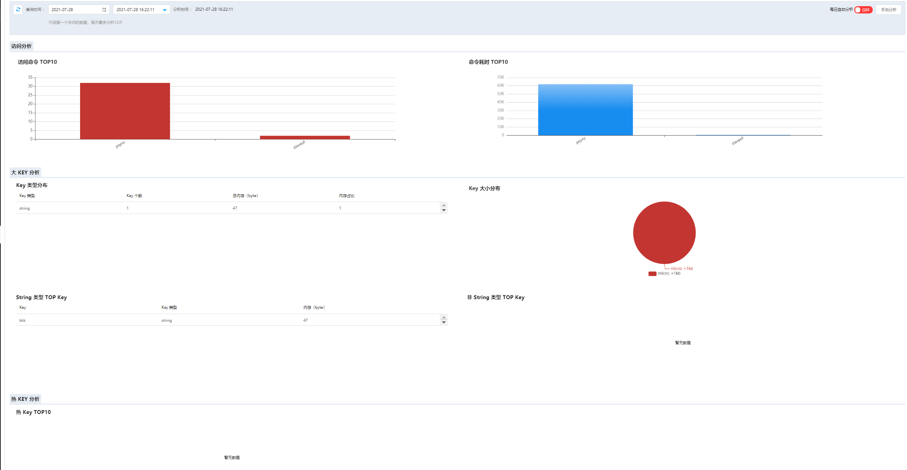

#  热key大key

大Key和热Key分析统计，大Key、热Key和访问信息是影响实例性能的关键指标

##  操作步骤

1. 登录 Redis 控制台，选择目标实例，点击实例名称进入实例详情页面

2. 先进入“参数修改”页tab签，配置相关参数。

   - Redis 4.0版要查看热KEY分析需要先修改参数，把实例maxmemory-policy参数配置为allkeys-lfu或者volatile-lfu（该参数默认为 volatile-lru）。

3. 点击“缓存分析”页tab签，进入缓存分析页面，选择要分析的时间段，即可获取该时段大Key、类型分布、大小分布

 

**注意：** 因版本不同，Redis 2.8版返回的分析结果无法统计内存大小，只能显示value长度，且无法进行热Key分析。

