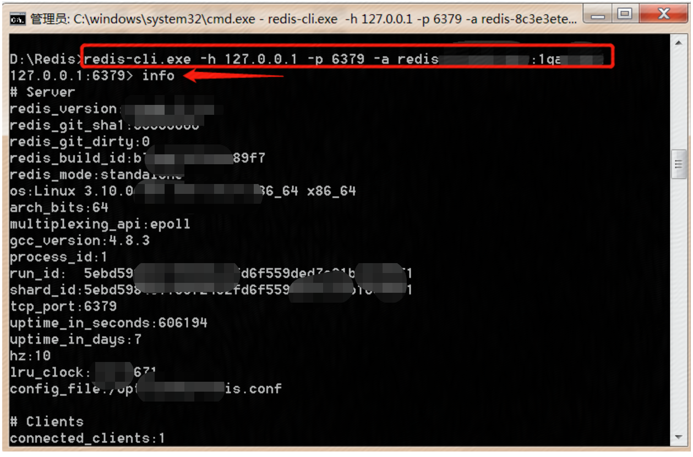
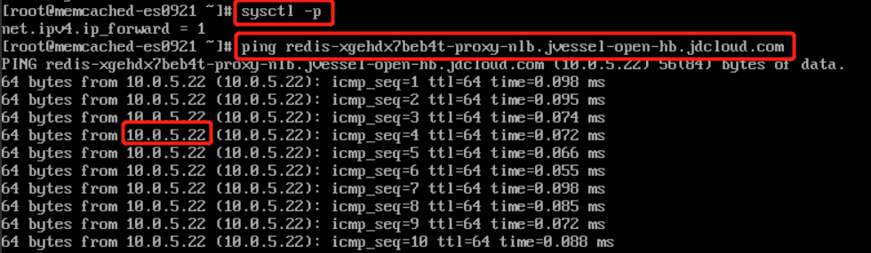
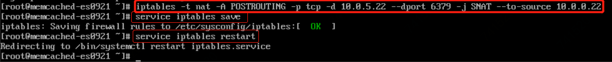

# 公网连接Redis实例（开发用）

## 通过云主机代理转发连接实例(Windows)

如果需要本地电脑连接京东云缓存Redis，您可以借助 SSH 的端口转发功能实现，以下以 Xshell 为例，说明设置方式。

###  前提条件：

  - 一台 Linux 系统的京东云主机，绑定公网 IP，

  - 与京东云缓存Redis在同一私有网络。

###  操作步骤

1、本地电脑安装 Xshell，以 SSH 协议远程连接到有公网IP的云主机。

  - 选择“连接”，输入名称、选择协议为 SSH；

  - 主机IP：填写京东云主机的公网 IP。

2、用户身份登录

  - 方法：Password；

  - 用户名：填写京东云主机的登录用户名，默认为“root“；

  - 密码：登录京东云主机密码。

 
 
3、设置端口转发规则。

  - 选择“SSH”下的“隧道”，点击“添加”。
 
  

4、填写转移规则信息

  - 源主机：填 localhost 或127.0.0.1；

  - 侦听端口：填写Xshell设置端口转发时的本地监听端口；

  - 目标主机：填写缓存Redis的域名，详见 京东云缓存Redis控制台 ，点击实例名称进入实例详情页，资源信息 –>访问域名；

  - 目标端口：填写缓存Redis的端口，详见 京东云缓存Redis控制台 ，点击实例名称进入实例详情页，资源信息–>端口，一般默认为6379。

  

5、连接测试（window端） 

  

## 通过云主机代理转发连接实例(Linux)

1、登录同VPC下的云主机(有公网)，安装iptables，并设置开机启动

    yum install iptables-services
    systemctl enable iptables.service
    

2、开启转发功能：

     #编辑配置文件
    vi /etc/sysctl.conf
    #添加或者修改以下内容
    net.ipv4.ip_forward = 1
    #保存后，使修改内容生效
    sysctl –p

  
  
  
   
  
3、添加iptables转发规则

    iptables -t nat -A PREROUTING -p tcp --dport [要转发的端口号] -j DNAT --to-destination [要转发的服务器IP] 
    iptables -t nat -A POSTROUTING -p tcp -d [要转发的服务器IP] --dport [要转发的端口号] -j SNAT --to-source [本机IP]

例如：云主机内网ip为10.0.7.186，redis域名为：redis-xxxxxxxx.cn-north-1.redis.jdcloud.com，可通过ping redis域名得到ip，假设为10.0.5.252，则要添加的转发规则是：

    iptables -t nat -A PREROUTING -p tcp --dport 6379 -j DNAT --to-destination 10.0.5.252:6379
    iptables -t nat -A POSTROUTING -p tcp -d 10.0.5.252 --dport 6379 -j SNAT --to-source 10.0.7.186

 
  

4、保存并重启iptables服务

    service iptables save
    service iptables restart

5、连接测试（Linux）

 
 

###  注意事项

1. 用户最好把iptables nat转发的端口设为6379端口;

2. 在客户本地绑定host到云主机的公网ip。
