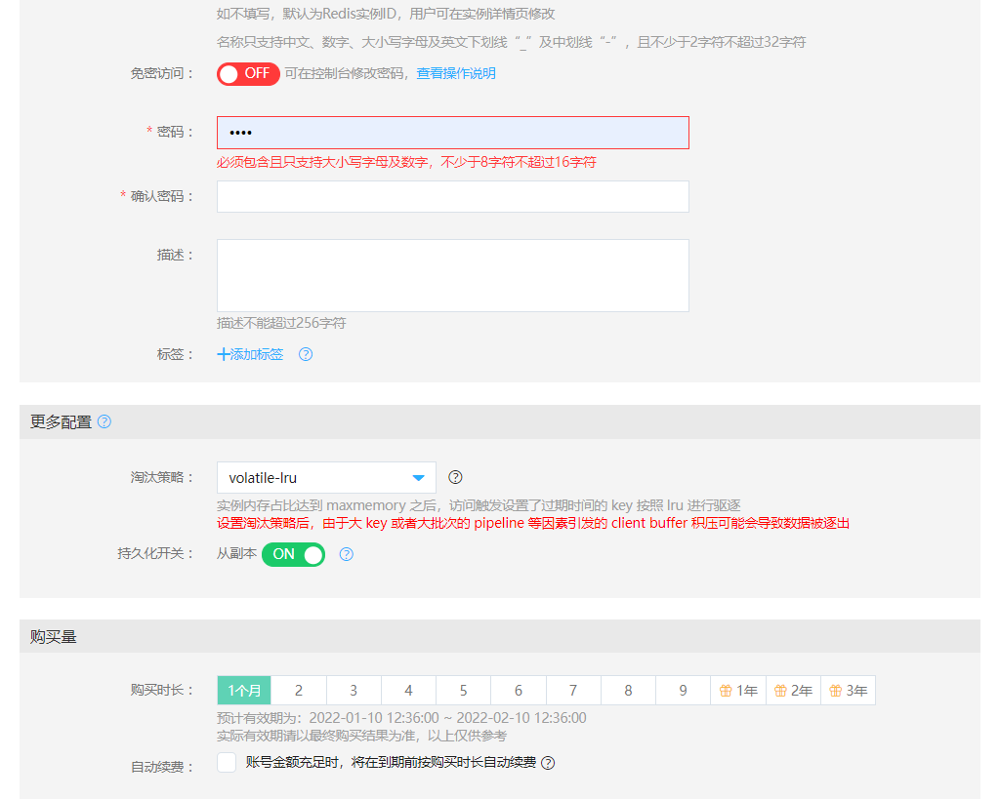
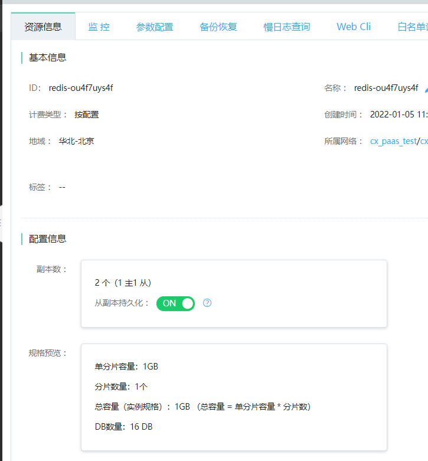

# AOF持久化开关

该功能可帮助用户对当前Redis实例的副本持久化进行配置。如果当前实例仅当缓存用则可不开启，不开启时当主备同时故障可能丢失较多数据；如果当前实例是当存储用，则建议开启。

##  操作步骤

AOF持久化开关的配置有两处入口。您既可以在新建实例时进行配置，也可以在实例创建成功后再进行修改。

###  在新建实例时进行配置

1.创建实例时，在“更多配置”部分，可以对从副本的持久化开关进行配置。

###  对运行中的实例进行配置

1.登录[Redis 控制台](https://redis-console.jdcloud.com/redis)。

2.在"实例列表"页面，选择目标实例，点击 实例名称，进入"实例详情"页面。在"实例详情"页面，在“配置信息”部分，可以对从副本的持久化开关进行配置。

