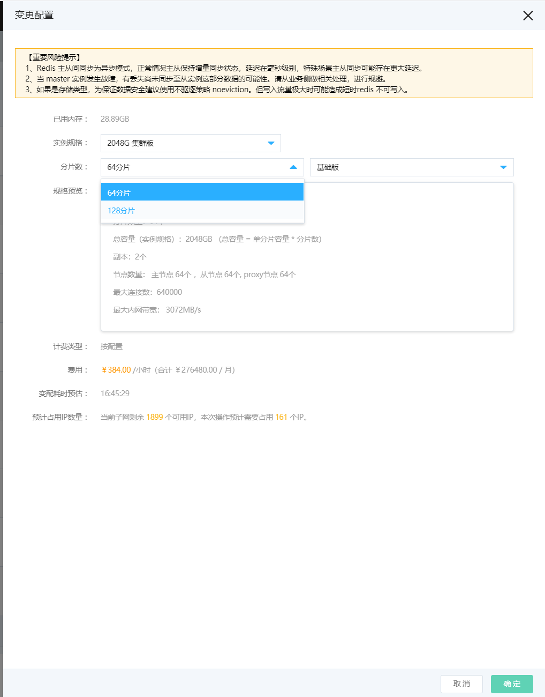
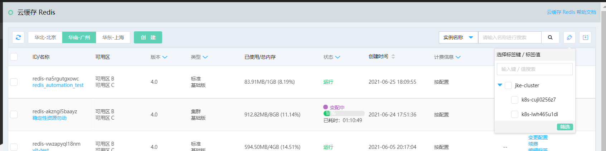

# 变更配置

Redis本身支持平滑水平、垂直扩缩容。当您需要进行扩缩容操作，调整云上资源的实例规格时，可通过变更配置进行操作。升配过程中redis性能会有所下降，但不影响写入， 建议在业务低峰期处理。

### 操作入口:

- 入口1：进入Redis控制台的实例列表页中，选择需要扩容的实例，操作列中的【变更配置】。

- 入口2：进入实例详情页，点击右上角【操作】下拉变更配置。

### 操作流程：

1、选择需要扩容的实例。

2、点击【变更配置】按钮。通过变更配置可以完成更改实例规格、变更分片数量、主从版和集群版切换等变配操作。

3、选择完目标配置后，点击【立即支付】按钮，即可进行变配操作。

- 升降配支持标准版变集群版、集群版变标准版

- 对于扩容操作，变配后的规格内存必须大于目前已用大小

**注意**

- 1） 按配置付费是后付费模式，当变更实例规格配置后将立即按新价格计费。

- 2）包年包月资源支持升配降配，升配需补差价，降配会以延长到期时间补偿差价 。

- 3）变更配置过程中将会需要占用一定资源的IP，请您提前预留充足。

### 变配进度

变配过程将会耗费一定时长，根据您的内存大小、分片数量等信息会有不同。为方便用户了解进度，当您选择要变配时，我们将提供预估的变配时长供您参考。见上图。

此外，在实例列表页，您也可以看到当前实例的变配进度、已消耗时长等信息。若变配过程中存在任何问题，可随时联系客服。

