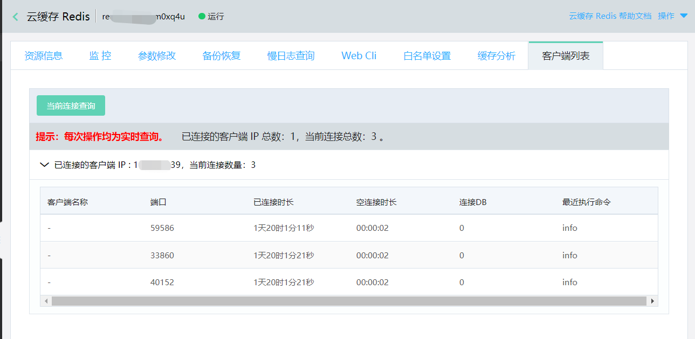

# 客户端IP列表

通过该功能可帮助用户查看当前已连接到云缓存Redis实例的客户端信息。

##  操作步骤

1. 登录[Redis 控制台](https://redis-console.jdcloud.com/redis)

2. 选择目标实例，点击实例名称进入实例详情页面

3. 点击客户端IP列表页签，进入客户端IP列表页

主要字段说明：

| 字段 |  说明  |
| :--- | :---  |
| 总计信息  | 返回总统计信息，包含已连接的客户端IP总数和当前连接总数 |
| 已连接的客户端IP | 当前连接到该实例上的所有客户端IP列表 |
| 客户端名称  | 连接到当前实例的客户端名称  |
| 端口 |  连接对应的主机端口信息  |
|  已连接时长 | 从连接建立开始到现在的时长 |
| 空闲时长 | 最后一次发命令到现在的时长，以秒为单位  |
| 连接DB | 该连接操作的数据库，默认为0 |
| 最近执行命令 |到查询为止发送的最后一次命令 |

