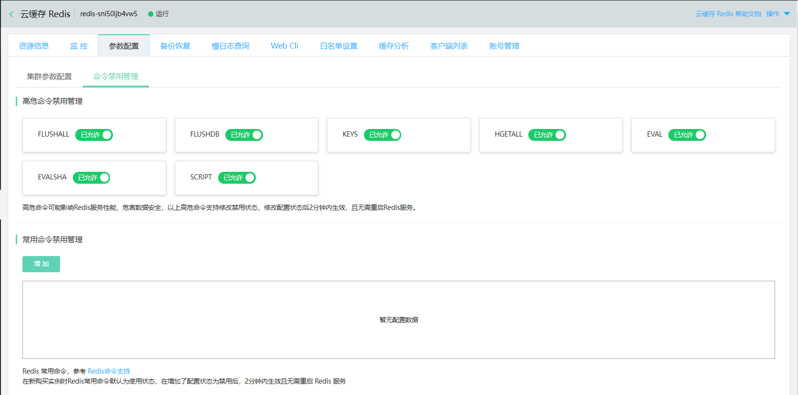
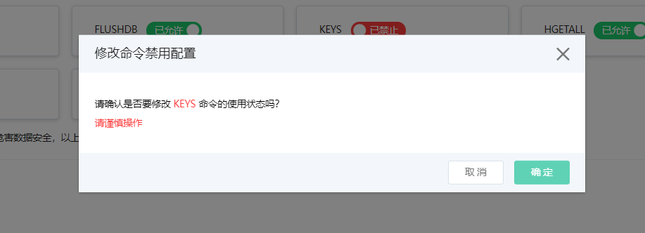
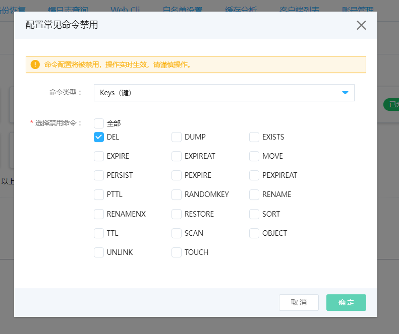
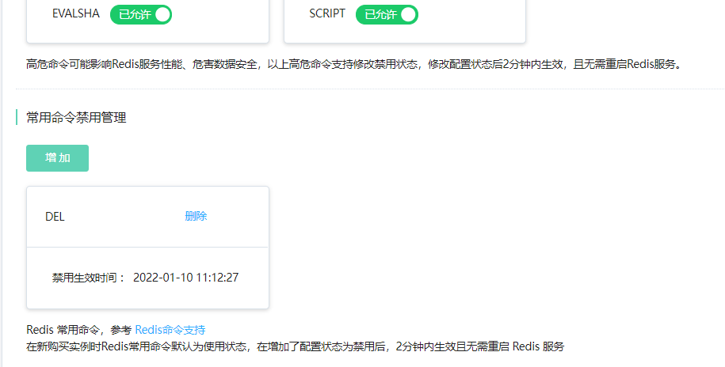

# 命令禁用

云缓存Redis 提供了命令禁用的功能，来帮助用户调整实例可支持的命令。通过在控制台实例详情中的参数配置下的命令禁用管理，来配置高危命令、普通命令的禁用状态。

## 注意事项

目前云缓存Redis提供支持 的版本为Redis4.0，Redis2.8不再支持。

该功能对新建的实例默认开放，对于该功能上线前的存量实例需要进行升级才能使用。如果您需要在原有实例上使用该功能，可联系我们并告知实例ID和升级时间，待升级完成后即可使用。

## 命令分类

高危命令：高危命令可能影响Redis服务性能、危害数据安全。但基于业务的需要，目前开放了7个高危命令供用户配置是否禁用，包含:FLUSHALL、FLUSHDB 、KEYS 、HGETALL、EVAL、EVALSHA 、SCRIPT   。

常用命令：对于Redis的常用命令，默认为可用状态，现可支持在实例级别配置是否被禁用。

## 操作步骤

### 配置高危命令禁用

1.登录[Redis 控制台](https://redis-console.jdcloud.com/redis)。

2.在"实例列表"页面，选择目标实例，点击 实例名称，进入"实例详情"页面。在"实例详情"页面，点击 参数配置 tab签页面，进入"命令禁用管理"页面。

3.对于要配置禁用的高危命令，进行一键开关配置。修改该配置状态后2分钟内生效，并且无需重启Redis服务。

### 配置常用命令禁用

1.登录[Redis 控制台](https://redis-console.jdcloud.com/redis)。

2.在"实例列表"页面，选择目标实例，点击 实例名称，进入"实例详情"页面。在"实例详情"页面，点击 参数配置 tab签页面，进入"命令禁用管理"页面。

3.对于常用命令，点击“增加”操作，先选择命令类型，再对要禁用的命令进行逐个选择配置。

4.配置完成后2分钟内生效，并且无需重启Redis服务。

### 取消命令禁用

1.对于高危命令，如需取消命令禁用，直接点击开关配置允许即可。

2.对于常用命令，删除相应的命令即可取消命令禁用。

