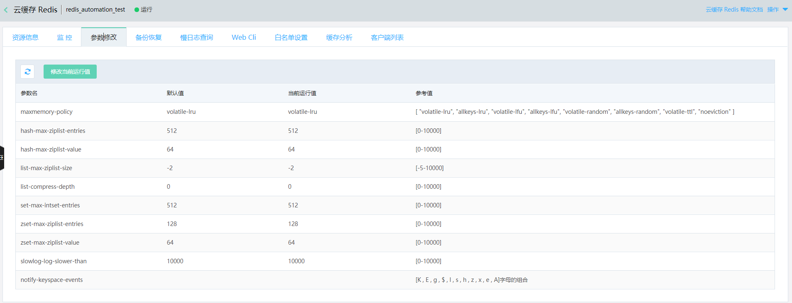

# 参数修改

该功能可帮助用户对当前Redis实例的参数进行配置调优。目前，云上参数修改中开放了九个参数供用户修改。

##  操作步骤

1. 登录 Redis 管理控制台，选择目标实例，单击实例名称进入实例资源信息页面；在标签栏中，选择参数修改标签。

2. 点击修改当前运行值操作后当前运行值列变为可输入，在输入完后点击保存既完成修改。

| 参数名称  |  参数说明  | 默认值	  |  参数范围  |  
| :--- | :---  |:---  |:---  | 
|  maxmemory-policy	 | 达到最大内存使用率时数据的移除策略		  |  	 volatile-lru | 请参考后文。注意4.0版比2.8版本多allkeys-lfu,volatile-random  | 
|  hash-max-ziplist-entries	|  当hash的key的数量不大于指定值时，使用特殊存储(ZIPLIST)来节省空间  |	512		  |  0-10000	  |  
|  hash-max-ziplist-value	|  当FIELD和VALUE的长度不大于指定值时，使用特殊存储(ZIPLIST)来节省存储空间  |	64	  |  	0-10000	  |  
|  list-max-ziplist-entries(2.8版)	|  当列表的数据不大于指定值时，使用特殊编码（ziplist）来捷顺存储空间  |	512	  |  	0-10000	  |  
|  list-max-ziplist-value(2.8版)	|  当value的长度不大于指定值时，使用特殊编码（ziplist)来节省存储空间  |	64		  |  0-10000	  |  
|  list-max-ziplist-size(4.0版)	|  用ziplist编码实现的列表对象，按照数据项个数或占用的字节数，限定ziplist的长度  |	-2		  |  -5-10000	  |  
|  list-compress-depth(4.0版)	|  用ziplist编码实现的列表对象，quicklist两端不被压缩的节点个数  |	0	  |  0-10000	  |  
|  set-max-intset-entries	|  当set数量不大于指定值时，使用特殊编码（intset）来节省存储空间  |	512		  |  0-10000	  |  
|  zset-max-ziplist-entries	|  当zset元素数量不大于指定值时，使用特殊编码（ziplist）来节省存储空间  |	128		  |  0-10000	  |  
|  zset-max-ziplist-value	|  当元素值得最大长度不大于指定值时，使用特殊编码（ziplist）来节省存储空间  |	64		  |  0-10000	  |  
|  slowlog-log-slower-than	|  慢日志功能记录命令的最大执行时间，单位：微秒  |	10000		  |  0-10000	  |  

####    驱逐策略maxmemory-policy参数说明
| 参数名称  |  参数说明  | 
| :--- | :---  |
|  volatile-lru  |  只对设置了过期时间的key进行LRU（默认值）。  |  
|  volatile-random  |  只限于设置了expire的部分，删除一部分expire的key。  |  
|  volatile-ttl  |  只限于设置了expire的部分，优先删除剩余时间(time to live,TTL)短的key。  |  
|  allkeys-lru  |  优先删除最近最少使用的(less recently used,LRU)key。  |  
|  allkeys-lfu  |  在所有的key中使用LFU算法淘汰数据 。 |  
|  allkeys-random  |  随机删除一部分key。  |  
|  noeviction  |  不删除策略，达到最大内存限制时，如果需要更多内存，直接返回错误信息。  |  
| volatile-lfu | 只对设置了过期时间的key使用LFU算法淘汰数据。  |  

