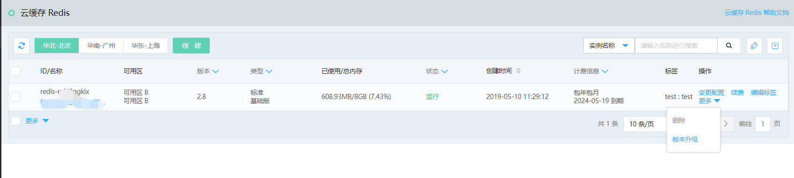
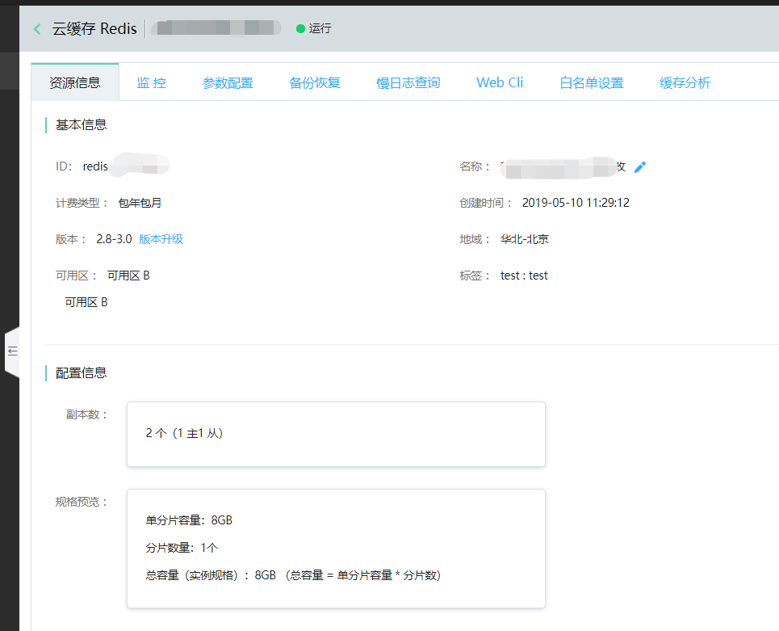
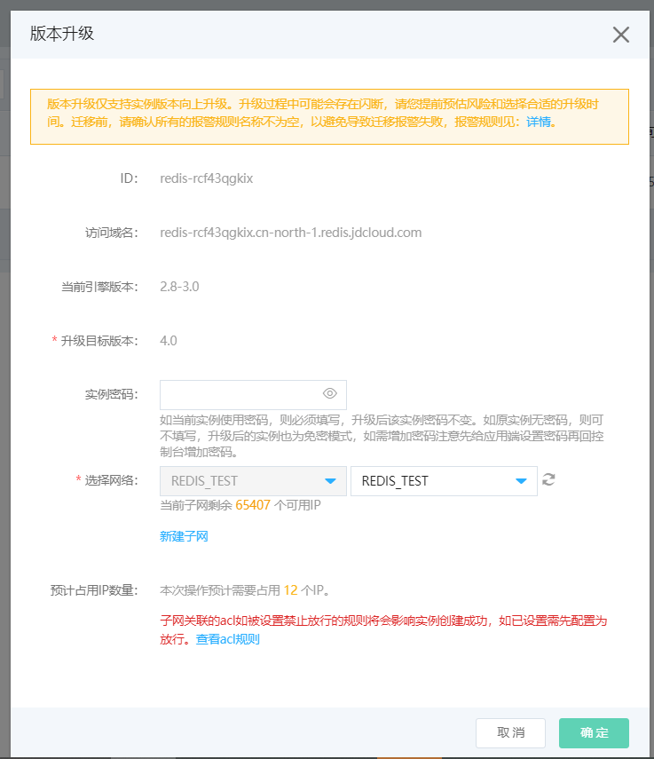
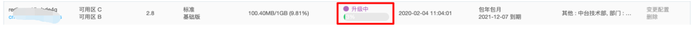

#  升级实例版本

云缓存Redis 支持进行兼容版本升级，帮助用户升级实例至最新版本，体验更丰富的功能。

##  升级说明

- 目前仅Proxy架构的实例支持升级兼容版本，不支持降级兼容版本，且变更前后费用不变。

- 仅支持低版本实例向高版本升级，例如从Redis 2.8 升级至 Redis 4.0。

- 升级过程将会临时占用部分IP资源，请您根据系统评估预留足够的IP资源。

- 在Redis2.8 升级完成后，Redis2.8域名和Redis4.0域名都能正常访问，但强烈建议应用及时更换为新访问域名。

- 升级前请您做好数据备份。

##  升级影响

- 升级时间根据实例规格将各不相同，连接闪断（秒级）的影响，需要业务具备自动重连的机制。

- 升级过程中会存在连接闪断（秒级），重连即可（如果是长链接有可能需要重启应用）。请您提前预估风险和选择在低业务流量时执行。

- 迁移前，请确认所有的报警规则名称不为空，以避免导致迁移报警失败。
- 

##  操作步骤

1.版本升级有多处入口：

1）Redis列表的操作中，如当前实例存在可升级版本，将提供“版本升级”操作。如无该操作则代表当前实例使用的为最新版本。

2）在实例详情页“基本信息”中，在“版本”信息部分，提供升级入口。

2.点击“版本升级”操作，进行版本升级配置。

- 如果当前实例已经使用了密码，则升级过程需要填写该密码，升级后该实例密码不变。如原实例无密码，则无需提供密码，升级后的实例也为免密模式，并可在升级完成后再设置密码。

- 升级过程将会临时占用部分IP资源，请您根据系统评估预留足够的IP资源。

3.升级过程中，在列表页将会提供进度条参考。

4.升级完成实例状态变为运行中后，即可正常使用。
