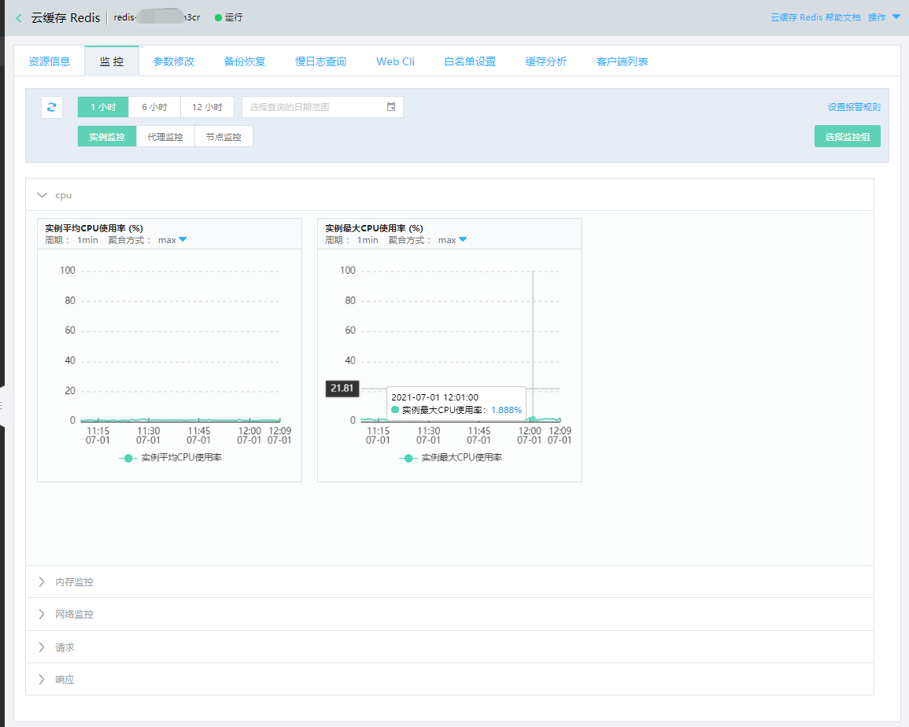
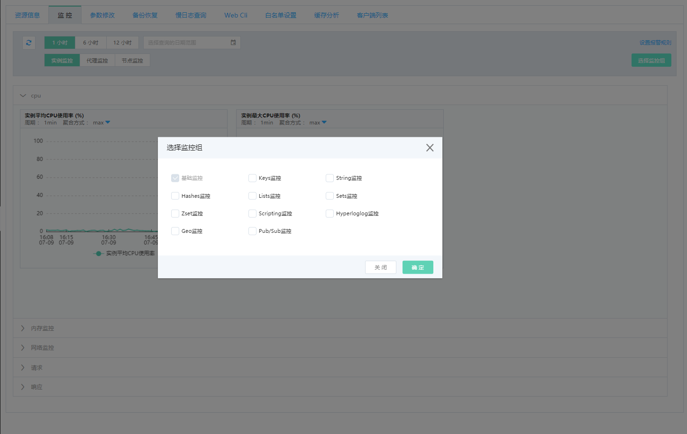
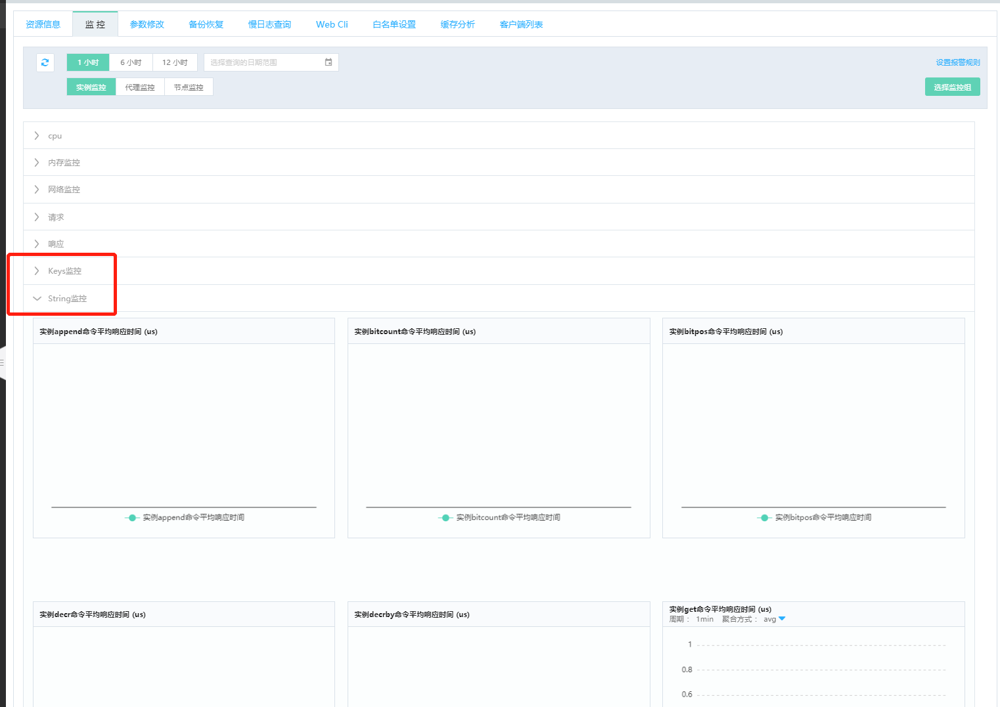

#  查看监控信息

云缓存Redis提供丰富的监控指标，通过控制台、OPENAPI您可以轻松获取监控信息，实时掌握实例运行状况。

##  监控内容说明

云缓存Redis从实例监控、代理节点监控、Redis节点监控3个维度，提供了基础监控组和命令统计类监控组。基础监控组包含了CPU、内存、网络、请求、响应等类别监控指标，命令统计类监控组包含了Keys、String、Lists等多个维度的监控指标，用户可通过AVG、MAX、MIN、SUM、LAST 等聚合算法查看数据。

1、实例监控。提供整个实例的监控数据，包括 Proxy 节点和 Redis 节点的监控数据。

2、代理监控。提供了实例上所有Proxy 代理节点监控。

3、节点监控。目前云上的标准架构和集群架构均为主从架构，当前提供的 节点监控信息，含主节点监控信息(名称中包含“-master-”)、副本节点监控信息(名称中包含“-slaver-”)、分片监控信息(名称中包含“-shard-”)。

##  操作步骤

###  查看基础监控

下面以控制台为例说明查看方式：

1、登录 Redis 控制台 ，定位目标实例。点击实例名称进入实例详情页面，在上方导航Tab页中选择“监控”。

2、根据不同时间维度需要，可依次查看实例监控、代理节点监控、Redis节点监控。当前趋势图的数据展示粒度为1分钟。

 

###  查看命令监控

1、登录 Redis 控制台 ，定位目标实例。点击实例名称进入实例详情页面，在上方导航Tab页中选择“监控”。

2、点击“选择监控组”，在弹框中选择要查看的命令监控组。支持多选。

 

3、所选的监控组信息，将依次在基础监控项之后面展示。在这部分将会展示该分组中每个命令的平均响应时间和调用次数。

 

