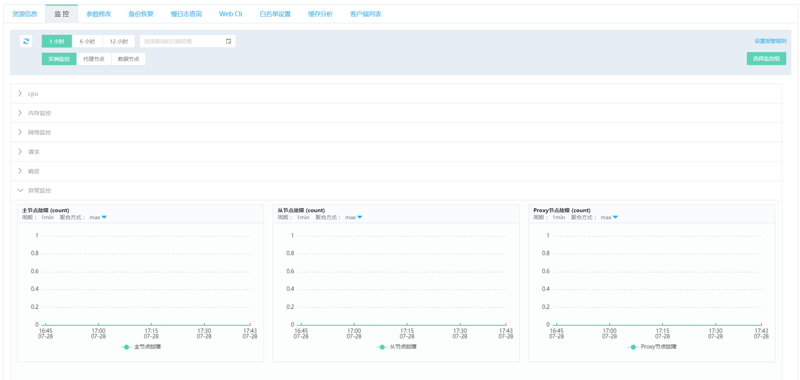
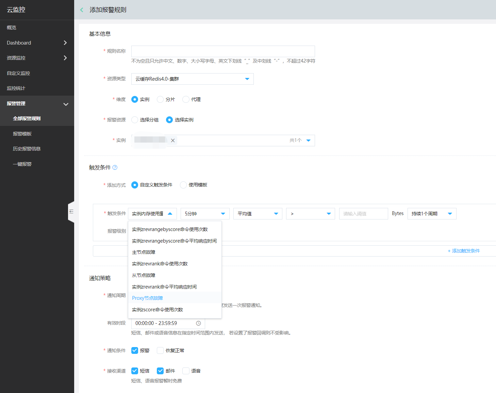

# 节点异常监控

业务的Redis主从可能分布在不同可用区，当发生主从切换后，用户可以在控制台的监控中查看到节点故障，也可以通过监控报警来配置短信、邮件、站内信的方式通知，以便快速响应检查相应的业务。

## 控制台查看异常监控

 1.  登录 [Redis 控制台](https://redis-console.jdcloud.com/redis)，选择目标实例，点击实例名称进入实例详情页面。

 2.  点击“监控”页签，进入实例监控页面。在基础监控后的“异常监控”组中，即为当前实例的异常监控。

以“实例监控”页为例说明：

- 主节点故障监控图，反映了当前实例的所有主节点（命名中含有“-master-”的节点）发生故障的次数和时间。

- 从节点故障监控图，反映了当前实例的所有主节点（命名中含有“-slaver-”的节点）发生故障的次数和时间。

- Proxy节点故障监控图，反映了当前实例的所有Proxy代理的（命名中含有“-proxy-”的节点）发生故障的次数和时间。

## 配置监控报警

 1.  点击监控页右上角“设置监控报警”按钮，进入报警规则配置页。然后点击“添加报警规则”操作。

 2.  在添加报警规则配置页中，选择“实例”维度，在触发条件中选择所需报警指标和触发条件、报警级别，如图中所示的主节点故障、从节点故障、Proxy节点故障。

 3.  触发条件可配置多条，然后添加通知策略，保存成功后，主从节点故障报警即配置生效。 
 

