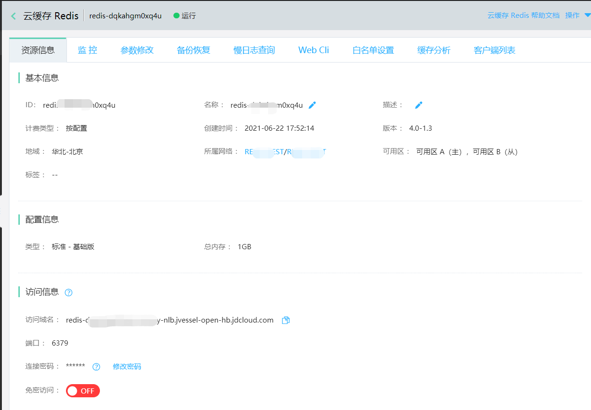
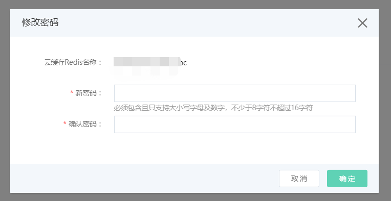

# 免密和修改密码

云Redis实例既支持密码方式访问，也支持免密码访问，两种方式可随时按需修改。修改时，请注意配合客户端密码的修改。

## 设置免密访问

在Redis实例的详情页的访问信息栏里，打开免密按钮。即可免密方式访问实例。**注意：** 免密状态下无法使用云控制台提供的 Web Cli 工具。

1. 登录[Redis 控制台](https://redis-console.jdcloud.com/redis)

2. 选择目标实例，点击实例名称进入实例详情页面。

3. 在详情页的访问信息栏里，打开免密按钮。

## 设置密码访问

当您计划从免密访问改为密码方式访问时，需要客户端配合操作。

1. 修改业务相关的代码配置，加上将要设置的密码。

2. 在控制台上，关闭免密访问并给实例设置redis的密码。

3. 上线加上密码配置的服务。

## 修改旧密码

当您已忘记实例密码，或者需要对实例密码进行修改时，可选择修改密码功能。修改密码的入口有2个：

1. 登录[Redis 控制台](https://redis-console.jdcloud.com/redis)， 选择目标实例，点击实例名称进入实例详情页面

2. 点击实例详情页的右上角[操作]下拉选择修改密码，弹出窗口输入新密码，确认密码后点击确定

#  常见问题

**Q：redis由免密设置为密码认证后，对客户端的影响？**

A：修改密码的过程会对客户端产生影响，建议尽量在业务低峰期操作。与redis建立的旧链接不受影响，与redis建立的新连接会受到影响。

