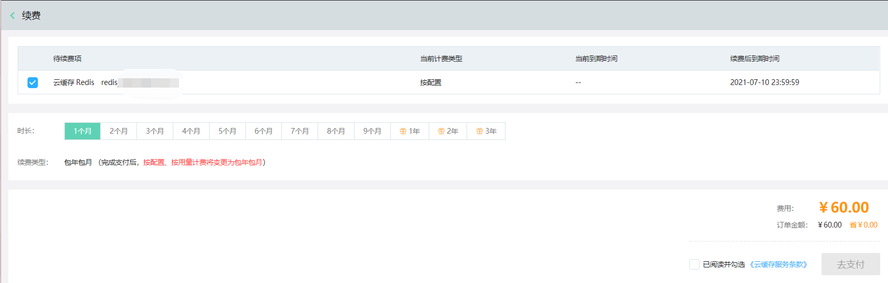

# 购买流程

## 使用限制
为保证实例能顺利创建，购买实例前请仔细查阅实例使用限制，详细请参考：[使用限制](../Introduction/Restrictions.md)  。

##  前提条件
### 账户准备
在开始创建实例之前，您需要先完成京东智联云账号的注册、实名认证并为购买资源做好支付准备。

### 账号注册
若您已有京东智联云账号，可跳过本步骤进行后续设置。 若您还未注册京东智联云账号，可在京东智联云官网进行注册，请参考 [注册京东智联云](https://user.jdcloud.com/register)  。

### 账号认证
实名认证是在京东智联云购买并使用资源的前提，您可选择对账号进行个人实名认证或企业实名认证，请参考 [实名认证](https://docs.jdcloud.com/cn/real-name-verification/introduction
) 。

### 支付准备
如您购买按配置计费实例，由于采用后付费模式，为避免计费周期内账户余额不足导致资源扣款失败，进而影响实例正常使用，在开通按配置计费实例时，为保证您的正常使用，开通按配置计费的实例时您的账户余额及可用代金券之和不低于消费门槛。同时可根据所选实例配置及关联资源配置和使用时长预估使用费用进行充值，保证现金余额或可用代金券充足。

如您购买包年包月实例，由于采用预付费模式，您需要一次性支付所选实例配置在指定生命周期内的全部费用，因此需要账户余额（现金余额+可用代金券金额）充足或在付款时选择第三方支付完成付款。

##  操作步骤

### 购买Redis实例流程

1.用户使用用户名密码登录 京东云控制台；

2.选择数据库与缓存大类下的缓存Redis产品，进入Redis控制台界面；

3.点击“新建”按钮，跳转到Redis产品订购页；

4.选择付费方式、地域、规格、网络、部署方案、基本信息、购买量等，核实无误后点击“确定购买”；

5.跳转到订单确认付费界面，勾选同意《缓存Redis服务条款》，点击“去支付”；

6.付费完成后，在控制台等待1-3分钟，实例变为运行状态，购买实例完毕，可正常使用。

##  包年包月与按配置支付类型转换

如果您的资源为包年包月付费类型资源，将不能转换为按配置付费。如需删除，可提交工单。

如果您的资源为按配置付费类型资源，可通过控制台转换为包年包月资源。操作流程如下：

1.找到要续费的实例，点击“操作”中的“续费”操作。

2.即跳转至对应续费页面，确认实例信息和购买信息，提交付款。

