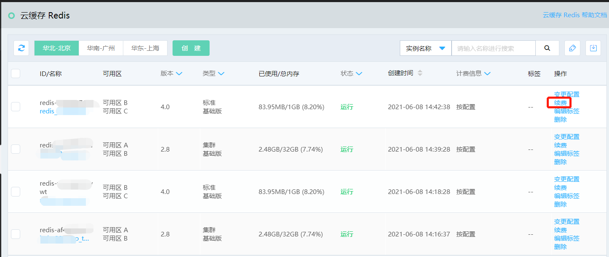

# 续费流程

## 续费入口
续费有两个入口供用户进行续费操作：

Redis产品列表页，可对包年包月的Redis实例进行快捷续费操作。下文将介绍该流程，见： [Redis产品列表页]( https://redis-console.jdcloud.com/redis)  

管理所有云产品续费的的“续费管理”中，可对资源进行续费、开通自动续费、设为到期不续费等常规续费操作，详见： [续费管理](https://renewal-console.jdcloud.com/renew/redis)   

用户可对资源进行手动续费，也可进行自动续费。

## 操作流程

###  手动续费

1.找到要续费的实例，点击“操作”中的“续费”操作。

2.即跳转至对应续费页面，确认实例信息和购买信息，提交付款。

3.付费完毕即续费成功。

###  自动续费

为用户提供对于已购买的有长期使用打算的包年包月资源提供的续费设置功能。

您可以在 [Redis续费页](https://renewal-console.jdcloud.com/renew/redis)  页面，对包年包月资源进行自动续费设置。

1、自动续费支持设置、修改、取消。取消了自动续费的资源，我们将恢复对其正常的到期检查与提醒；

2、设置了自动续费的资源，根据用户自选续费时长，在资源到期后会自动续费延期至对应时长；

3、自动续费扣款于服务到期前7天（自然天）开始扣款，实时出账单，可在“消费记录”页面进行查看；

4、若自动续费未扣款成功，每天早八点定时自动续费扣款一次，持续至服务到期日，直至扣款成功；如果您的账户可用余额不足时将无法自动续费，请注意保持账户余额充足；

5、已过期资源不支持自动续费；

6、已开通自动续费功能前提下，用户人工续费，则按人工续费后的到期时间自动执行自动续费。

## 常见问题

**Q： 删除后的资源是否可恢复。**

A：软删除保护期为3自然日。保护期内，可通过提交工单申请恢复。

