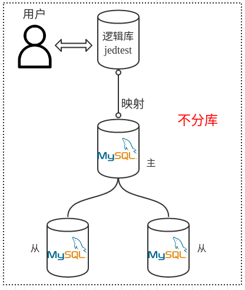
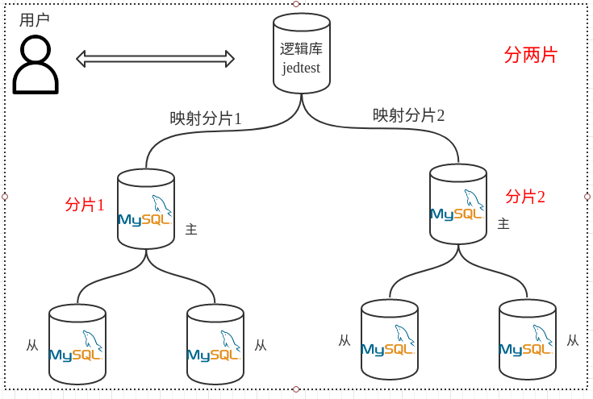
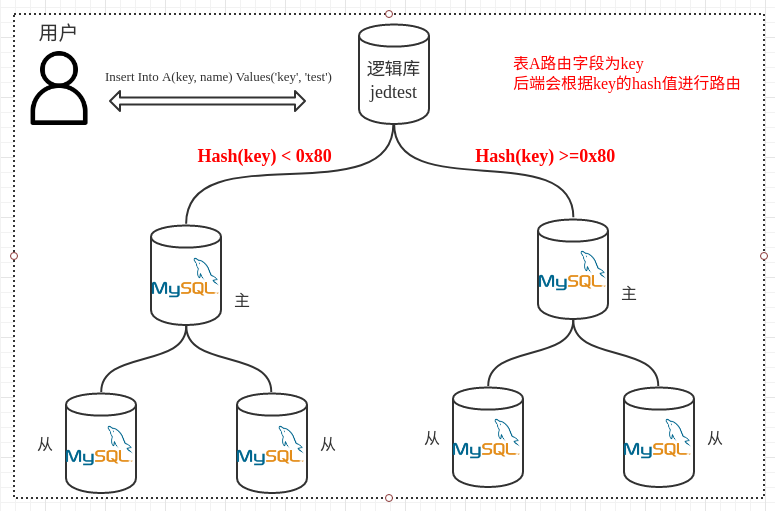
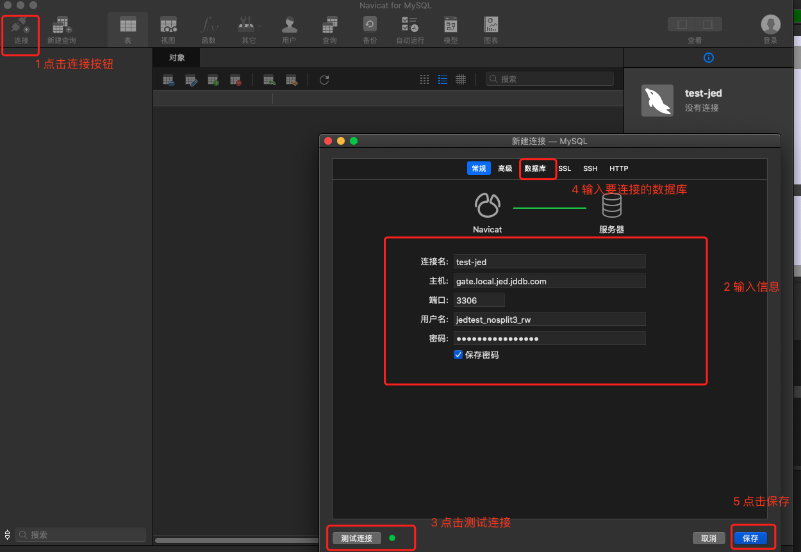
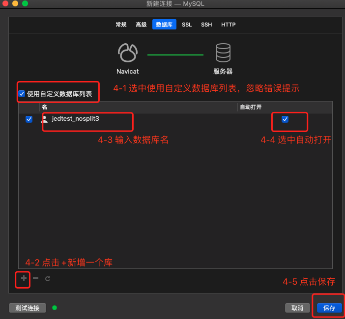
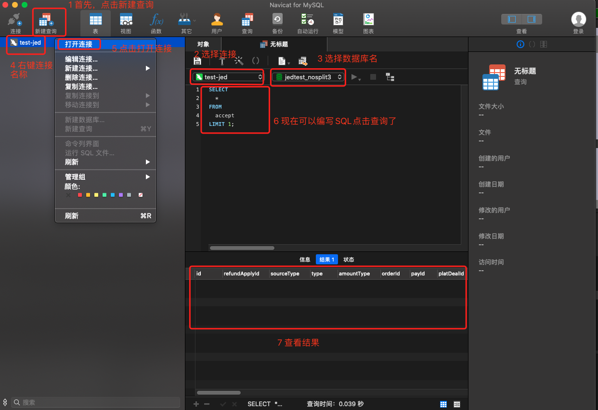

# FAQ

## JED中分库和不分库有什么区别?

如下图所示，不分库和分库(2片)的情况下，逻辑库和后端实际库的对应关系，用户访问时都是通过负载均衡访问逻辑库。





## JED 中拆分字段(路由字段)主要作用是什么？

JED 提供以分库的形式达到数据库的水平拆分， 拆分字段的主要作用就是用来对表数据进行水平拆分。比如用户老数据表A有1000万数据， 迁移到 JED 后分两片， 每个分片就会均匀的有500万数据。

这就需要使用表A的某一个字段(最好是唯一键，或者重复性较小的字段)，这样对拆分字段值做hash才能保证数据均匀分布在两个分片上； 

比如：A表的结构如下

```mysql
CREATE TABLE `A` (
  `id` int(11) NOT NULL AUTO_INCREMENT COMMENT '主键',
  `key` varchar(32) NOT NULL COMMENT '路由字段',
  `name` varchar(32) DEFAULT NULL COMMENT '姓名',
PRIMARY KEY (`id`)
) ENGINE=InnoDB DEFAULT CHARSET=utf8;
```



## JED支持分库分表吗？

JED不提供自动拆表的功能。 只对库级别进行拆分，如果有拆分表的需求(数据量特大的场景)，用户需要自行实现分表逻辑。

由于JED是以分库的形式达到表的水平拆分的，因此应对数据量特别大的场景时，建议使用分片+分表的方式（业务代码实现）

分表可以维持单个表的数据量比较少，提升性能，另外做DDL时影响也小。200G的大表及20G的小表做DDL，对数据库的影响也是不一样的。

对于分片的场景，分表无需过多。一般控制逻辑库中表的数量在300以下即可，比如有15个逻辑表，每个逻辑表分16个表，总体有240个表。

## JED如何保证多个分片数据均匀？

JED基于hash算法完成数据的散落，可以在hash算法的保证下继续通过调节range的范围来达到数据的均匀，虽然是基于hash算法主要还是需要依赖业务拆分字段的具体数据，所以拆分字段的选择也非常关键。

## JED对拆分键（路由字段）的设置有什么限制吗？

JED 对拆分键的选择有一定限制:

- 拆分键不能使用自增主键；

- 拆分键的值类型不会隐式转换。以字符串形式写入就需要以字符串方式查询；以数字方式写入就需要以数字方式查询。
`select * from xxx where key=100`和`select * from xxx where key='100'`两个sql可能路由到不同的分片；字符方式和数字方式的hash算法不一致

## JED对SQL语法的支持情况如何？有什么限制吗

JED支持DDL，支持大部分查询语句，但不包括复杂的特殊SQL，像子查询、JOIN与聚合函数一起使用等操作。

更多信息请参考[使用限制](../Introduction/Restrictions.md)

**注意弹性数据库不支持外键，建表语句存在外键会导致建表失败。**

## 关于并发和性能问题需要注意什么？

关于并发问题和吞吐量的问题业务方需要明确区别，一般QPS来描述吞吐量。在我们测试的场景下（20个varchar字段，长度 20， 读写3:7  拆分片数：3片 后端数据库4C 8G配置）单台QPS达到22200（瓶颈），JED的QPS接近理论上的 3倍。

并发问题：由于弹性数据库本身采用Golang语言开发。先天具有并发优势，不存在并发问题。并且JED的Gate（网关）端可以自动扩容，当负载过高时候可以自动扩增集群Gate数量，为并发和吞吐量提供更好的支撑。

## JED支持事务吗？

JED目前支持2pc（两阶段事务提交），支持单节点上的事务（与MySQL一致），不保证严格的分布式事务。

## JED能动态扩容吗？

JED支持动态reshardding，可以轻松完成分片再拆分。用户不用对自己的业务量进行过长时间的评估。

## JED支持读写分离吗？

JED支持读写分离 ，但是读写分离不是程序自动根据SQL去同步，而是通过不同的账号来处理读写分离，比如xxx_rw用户是读写账号，xxx_rr用户是只读账号，读写账号访问主库，只读账号访问从库。

## JED插入数据会返回LAST_INSERT_ID吗？

JED支持插入数据后可以返回 ID，支持LAST_INSERT_ID()函数。比如：`SELECT LAST_INSERT_ID();` 但是不支持LAST_INSERT_ID里面带表达式`LAST_INSERT_ID(current_value + _increment);`这种方式

示例:

```
begin;
insert into table (name) values('test');
select last_insert_id();
commit;
```

同时也支持在事务外获取LAST_INSERT_ID

## JED支持的MySQL客户端有哪些？

(1) 推荐使用官方免费开源的MySQL WorkBench，下载地址：https://dev.mysql.com/downloads/file/?id=474219

(2) 支持Navicat，从官网下载即可，注意JED与原生MySQL有区别，所以使用navicat连接的方式有所不同，请按照下图所示操作：

- 配置数据库连接基本信息（主机用户名等信息修改成自己的库信息）



- 配置数据库列表



- 开始使用



## JED对JDBC的兼容性怎么样？有什么注意事项吗？

JED对JDBC协议的兼容性做了支持，但在使用时有以下几点需要注意：

(1) 目前支持的字符集设置为utf-8以及utf8mb4（默认字符集），如果设置其他字符集，系统将返回错误。

(2) 不支持`'SET SESSION ...'`数据库变量设置。

(3) 不支持事务隔离级别在线更改。

(4) 不使用SSL时，用户认证只支持NativePasswordPlugin方式，即com.mysql.jdbc.authentication.MysqlNativePasswordPlugin。

(5) 单次事务的有效时间默认为30s，如果达到该时间的事务仍未commit提交或rollback回滚，则系统将执行rollback回滚操作并返回错误信息。

(6) 设置autoReconnect=true，否则容易超时，dbcp连接池配置validationQuery和testOnBorrow属性，c3p0配置testConnectionOnCheckin和testConnectionOnCheckout属性。

(7) MySQL驱动目前不支持mysql-connector-java-5.1.18版本或者更早的版本，支持mysql-connector-java-5.1.30 版本，这是因为过低的版本可能会导致连接不成功。

有些低版本会查询infomation_schema库信息，但是目前JED没有默认的infomation_schema库。 这时候业务程序端在建立链接的时候就会报错。报错如下：

```shell
2017-09-24 12:57:30,496 ERROR - com.alibaba.druid.pool.DruidDataSource[612] - init datasource error 
java.sql.SQLException: unsupported construct
```

遇到此问题升级 jdbc 驱动版本即可。

## 使用JED时经常碰到`Communications link failure`错误

出现这个错误后首先您需要确定两个场景

(1) 我线上第一次连接，启动程序就出现这个错误

如果是第一次使用出现这个问题，那么问题可能的原因就是程序就没有连接上数据库，可能原因就是jdbc连接配置错了、没有配置默认端口3358、账号密码不对、数据库驱动版本太旧， 数据库驱动版本请参考本页第14条第(7)项。

(2) 我线上已经运行了一段时间，可以正常查询数据和写入数据

出现这个错误的原因是，连接空闲时间超过10分钟被JED主动关闭了，关闭之后JDBC连接池不知道当前连接已经被关闭，再次使用的时候就会出现`Communication link failure`的错误， JED的网关属于共享网关集群，为了节约连接资源连接空闲超过10分钟就会被自动关闭； 

如果碰到以上问题请给jdbc增加探活配置，JDBC探活配置请参考[JDBC探活配置](./JDBC-Config.md)

以上配置仅供参考，我们只是搬运工为了您更方便的查找，我们相信专业的您很快就能解决问题。

## 为什么我可以写入数据但是查不出来？

请检查写入字段和查询字段类型是否一致，JED路由字段不支持隐式转换，不同类型的路由字段值解析出来的路由信息不一致。

## 遇到如`Aborted desc =transaction 1212132132432 : not found` 错误；

该错误主要是业务逻辑中有大事务，JED 默认事务超时时间是30s，不建议延长该值，事务超时时间越长并发量大的时候死锁的可能性越大。
出现该问题建议业务优化业务逻辑，减少事务时间。

- Sql执行时间超过tablet中的事物超时时间设置（config-server-transaction-timeout）tablet会自动kill掉该事物。报killing transaction错误。

- Sql 执行时间超过了tablet中的sql执行时间设置（config-server-query-timeout）tablet会自动kill掉该协程。报killing query错误。

解决方法： 优先排查业务逻辑，解决嵌套事务和大事务问题；

**如果您十分确认您业务中没有大事务，还有一种可能就是您业务配置的autocommit=false，所有的操作都会默认走事务，您需要修改该值为true，使用事务的地方通过begin/commit/rollback显式方式处理即可**

## 使用load进行推数的时候NULL值问题

目前弹性数据库对NULL的处理需待优化，如果源端（如hive）中有字段为NULL推送过来会被转换成Ｎ。 所以从hive读出的数据尽量把NULL值转换成默认值。
如字符类型替换成""， 数字类型转换成０。

## 使用JED的时候Group By key出现相同的key，分组不起作用

出现该情况并不是JED出错，而是业务数据确实不一样，主要原因是业务写入的时候字段里面带有空格，group by出现'key1' 和'key1 '日志里面看确实一样，但是两个key的值确实不一致

- 解决方法：业务方对数据进行处理，去除空格等干扰信息； JED 无法对业务的数据进行自动处理，所以必须需要业务来进行处理。

## 服务已经运行好久了，一直没有问题，突然出现了`uncategorized SQLException for SQL`错误，并发量也较高

出现以上问题可能是访问量较高导致容器OOM了，出现OOM的原因一般是慢sql较多占用内存多，同时并发量也大

解决方法:

- 查看主库内存监控信息，看看内存是不是在故障时间点达到了100%又回落

- 查看数据库慢sql日志，根据慢日志信息进行优化

## 报错`code = ResourceExhausted desc = transaction pool connection limit exceeded`

错误可能原因：

(1) 业务有大事务，导致事务连接池被长期占用，没有连接可以获取。或者机器负载太高io使用率太高导致响应延迟。

- 解决方法：业务排查；同时排查慢sql定位问题

(2) 主库磁盘写满，导致无法新建连接

- 解决方法：DBA清理磁盘

## 路由设置注意事项

JED 由于需要配置路由，所以对于sql中表名称是大小写敏感的，路由中字段的大小写必须和代码中表名称的大小写匹配，否则就可能出现找不到路由的情况

## 执行了一个sql出现以下错误：

`rpc error: code = DeadlineExceeded desc = Lost connection to MySQL server during query (errno 2013) (sqlstate HY000) during query: xxxxxxx`

出现这个错误是因为您执行了一个超级大的sql，sql执行时间超过300s，JED 有保护机制，对于超过查询超时时间的sql会自动kill掉。JED默认的查询超时时间是300s，如果查询超过300s会直接kill，防止影响其他业务； 如果出现该问题请您修改您的sql，保证在300s内能执行完成即可

不建议编写超过300s执行的sql，这样系统的吞吐量和性能会受到很大的影响。

## 服务启动的时候报错`Unable to acquire JDBC Connection`，没有其他的错误

出现这个错误的时候基本都是业务配置文件格式或者编码错误导致连接请求都没有发出来，通过重新生成配置文件一般都可以解决，该问题解决方案只能排查业务应用的配置文件格式或者url编码是不是有问题导致服务无法连接到正常的数据库网关。

正常情况下数据库网关决绝请求都会给出明显的错误，比如`Communications link failure、Access denied for user 'xxxxxxx_rw'、sql exception`等明显的报错信息

## JED分库情况下，拆分字段提供后，每次查询必须提供拆分字段吗？

弹性数据库拆分后建议查询都带拆分字段，否则会导致读放大； 放大的倍数和分片的数量一致

不带拆分字段的sql会发送到全部的分片，响应时间是最慢的一个分片的响应时间；业务不带拆分字段的sql如果并发量很大的话对后端数据库将是灾难

所以请业务尽量查询中带拆分字段，如果实在没法带就需要减少该sql的访问频率，通过缓存方式控制查询频率

## update时，不提供拆分字段，是否会全库进行更新？

在业务库已经拆分情况下，发送了一个不带拆分字段的update语句，该语句会分片发送到后端每个分片进行处理

## 弹性数据库支持@@IDENTITY吗？

弹性数据库不支持@@IDENTITY的使用，但是用户可以使用SELECT LAST_INSERT_ID()替换，效果是一样的

## 应用执行删除报错`The total number of locks exceeds the lock table size (errno 1206)`

出现这个错误的原因是数据库的参数innodb_buffer_pool_size 设置的不合理，修改该参数即可

## 报错：`rpc error: code = ResourceExhausted desc = grpc: received message larger than max (76820061 vs. 64554432)`

这个错误是因为一次性返回太多记录或者有大字段造成。

目前的限制是64M，防止返回太多记录，对网关造成影响，这个是对网关的保护，不能取消限制。

解决方法：

- 加上where条件（索引不要忘记，这样会减轻后端数据库的压力）、减少返回记录数，或者返回字段中不带大字段。

- 利用rs账号，进行流式查询；但流式查询，部分复杂语法支持不好。

## 使用后缀为rs的账号进行流式查询、抽数可以使用JOIN么？

不可以，报错 “Stream execute do not support join operation”。流式查询只支持简单的where过滤、排序、分组和分页查询，不能支持JOIN查询

## `ERROR 1153 (08S01): in-memory row count exceeded allowed limit of 10000000`

JED对网关层返回的中间结果和最终结果集的行数在内存中限制1000W行，这种策略主要是考虑对底层MySQL的保护，建议还是尽量减少结果集的大小，避免错误的sql把数据库打挂，如必须要检索更多的行数，建议使用_rs账号流式查询;
