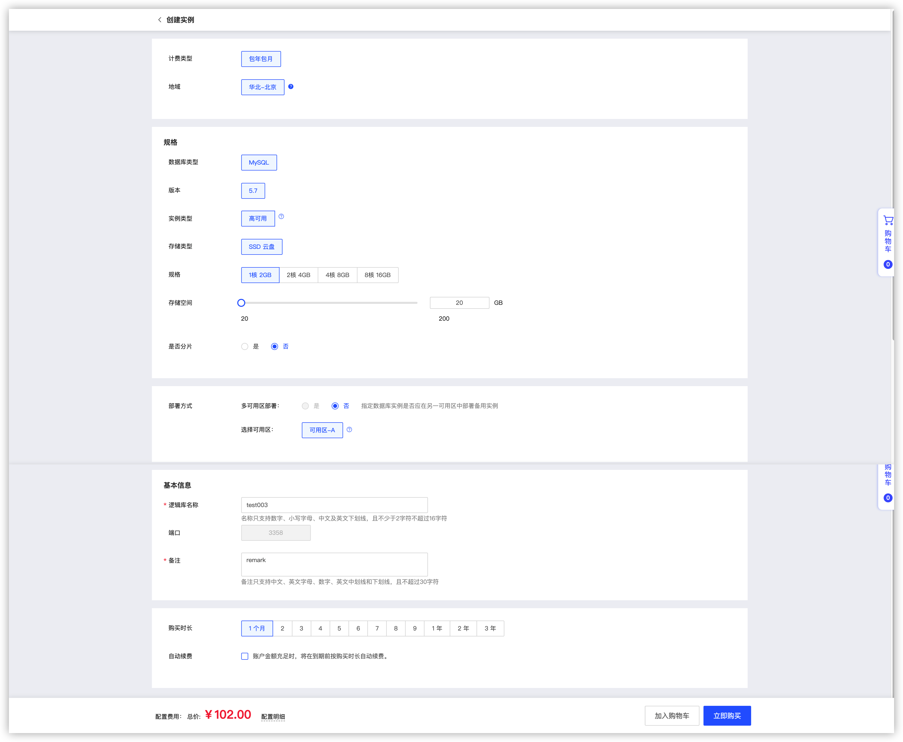
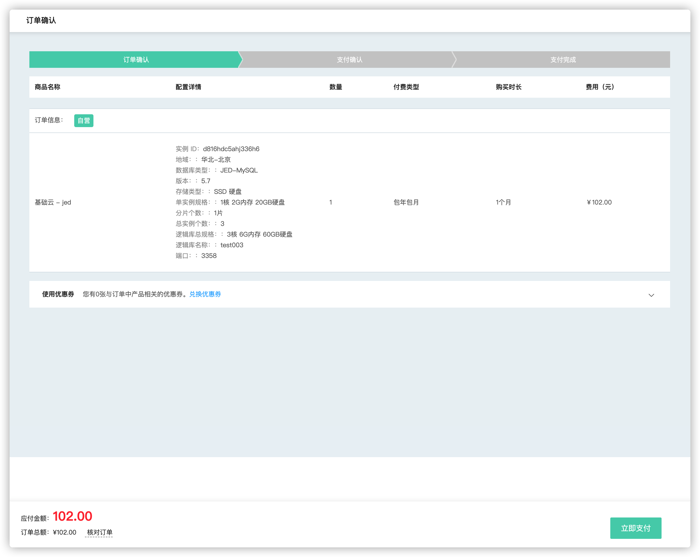
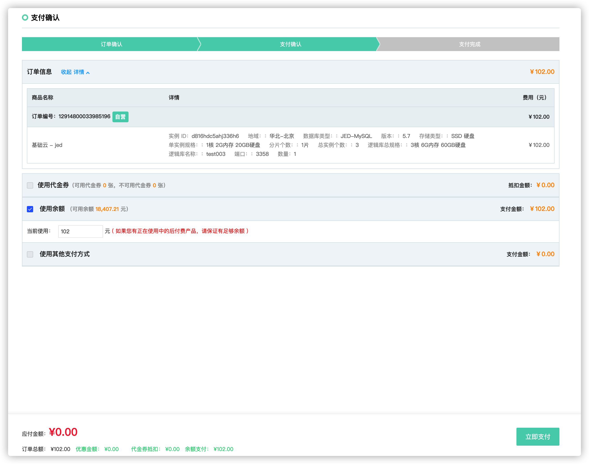
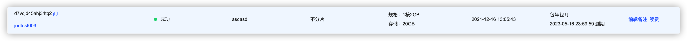

# 创建逻辑库

**1. 进入逻辑库列表页**

当前页面会显示当前区域下的各个 JED 逻辑库的概要信息，包括规格、创建时间、计费信息和过期时间等。点击 **【创建】** 按钮，新建一个 JED 实例。

**2. 选择规格**

进入到数据库配置页面，选择计费方式（包年包月），地域及其相关配置信息。下方可以查看在当前配置下的价格信息。

**建议用户选择最靠近您的地域，可降低访问时延、提高下载速度。**

**注意：不同地域间的内网互不连通。**

**3. 实例名、逻辑库名和端口号**
实例 ID 随机生成，逻辑库名为唯一标识，不可与同一个可用区下的其他用户重复，如提示库名已存在，请您更换一个可用的库名，数据库端口默认3358，暂不支持更改。

4. 选择购买时长

包年包月方式，选择购买的时长。

**5. 订单确认**

输入库名和备注并选择好规格配置后，可查看页面下方的价格信息，确认无误后点击 **【立即购买】**

**6. 支付确认**

再次确认购买信息无误后，点击 **【立即支付】**

**7. 实例创建中**

支付成功后自动返回实例列表页面，能看到实例状态为 **"创建中"**

**8. 创建完成**

稍等片刻，页面自动刷新，实例创建完成，状态为 创建**“成功”** 

