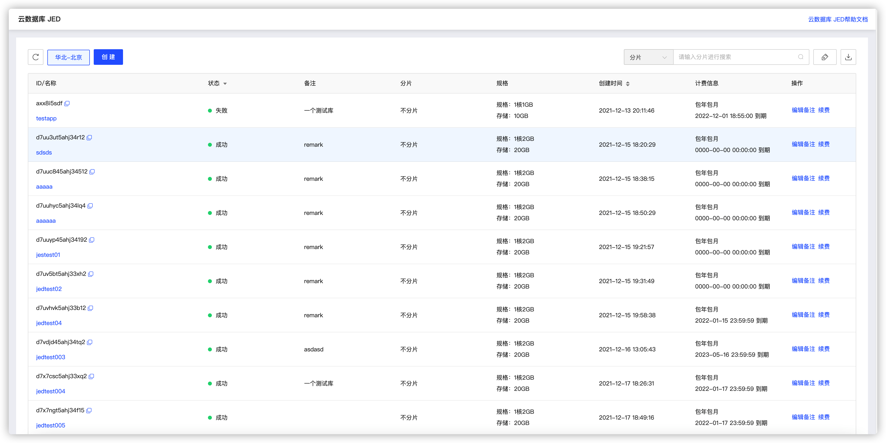
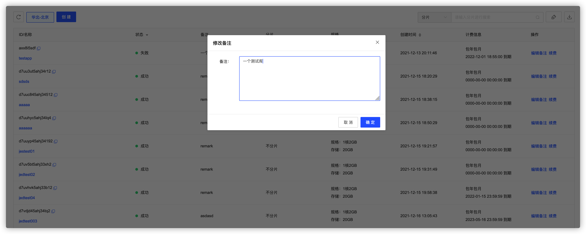
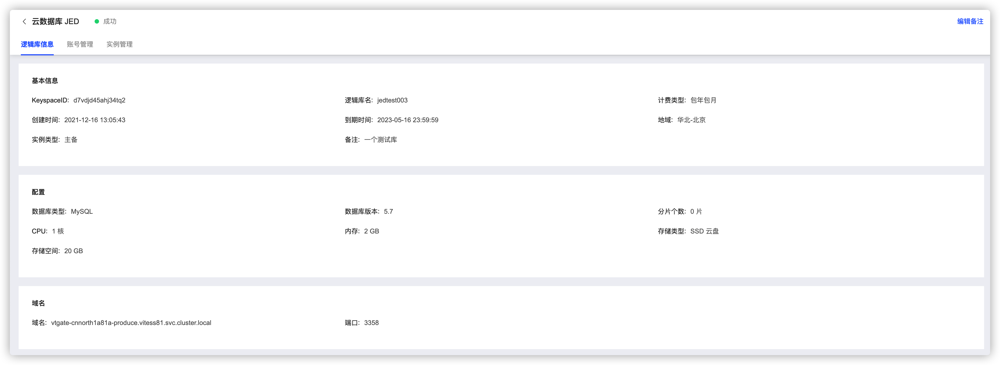

# 查看逻辑库

**1. 进入逻辑库列表页**

当前页面会显示当前区域下的各个云数据库实例的概要信息，包括逻辑库状态、备注、是否分片、规格信息、计费信息、创建时间和过期时间等。在右上方提供了搜索查询功能，可进行快速定位。

**2. 编辑备注**

点击右方操作按钮，可进行备注的编辑

**2. 查看逻辑库详情**

点击要查看逻辑库的名称，即可查看该逻辑库的详细信息

**3. 进入详情页面**

可在逻辑库信息详情页面查看逻辑库的各种基本信息，包括配置、域名等

