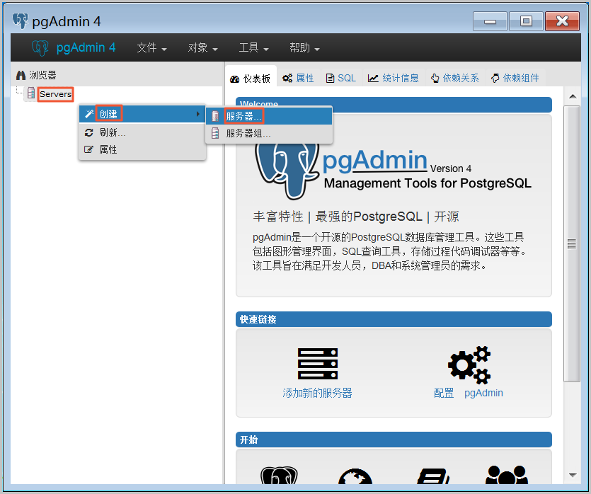
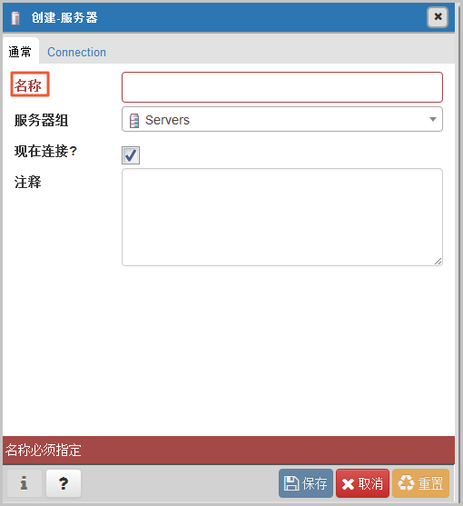
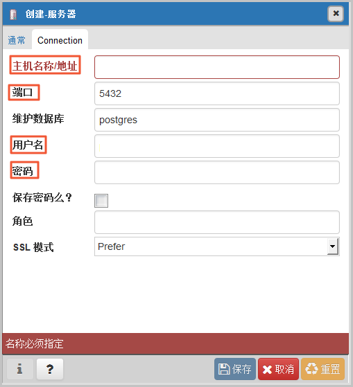
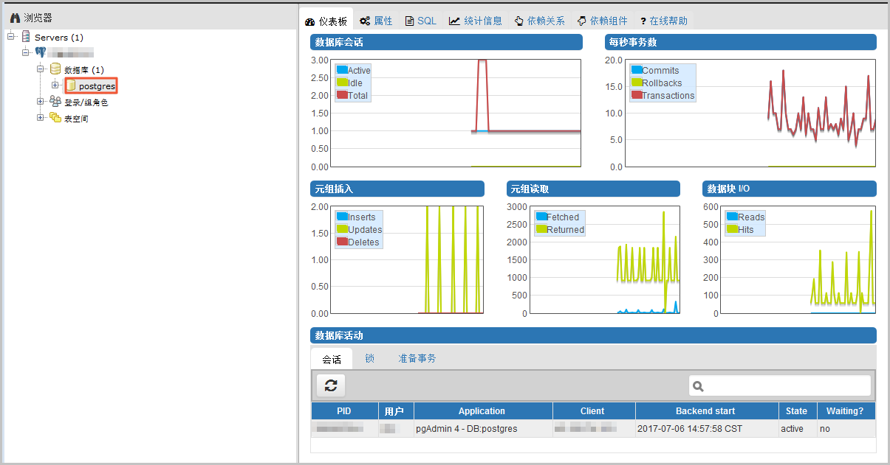

# 连接 PostgreSQL 实例
云数据库PostgreSQL实例支持通过本地客户端连接，默认不支持外网访问，需要手动开启，具体操作请详见 [开启外网访问](https://docs.jdcloud.com/cn/rds/internet-access)。
下面介绍通过 **命令行连接** 和通过 **pgAdmin客户端** 登陆两种连接方式。

## 准备工作
1，通过云主机连接云数据库PostgreSQL实例；
2，安装pgAdmin客户端；

## 连接方式
## 1、通过命令行连接
1. 登陆云ECS或 可访问京东云PostgreSQL数据库的设备；
2. 在京东云RDS控制台创建PostgreSQL实例用户；
3. 执行如下命令连接云数据库PostgreSQL：

```SQL
psql  -U\<user\> -h\<host\> -p\<port\> -d\<database\> -W
```
    
### 参数说明

 **\<user\>**  用户名，京东云PostgreSQL数据库账号
 
 **\<host\>** 要访问的云数据库的域名，域名展示在云数据库的详情页面
 
 **\<port\>** 端口号，默认端口为5432，端口号展示在云数据库的详情页面
 
 **\<database\>** 需要连接的数据库名，默认的管理数据库是postgres
 
 **-W** 是强制用户输入连接密码选项，上述命令执行后，根据提示输入密码
    
### 示例
用户名为test_user 连接postgres数据库实例：
```sql
psql  -U test_user -h 192.168.0.44 -p 5432 -d postgres -W
```
## 2、通过客户端pgAdmin登录云数据库PostgreSQL
 1.将要访问RDS实例的IP地址加入RDS白名单中。
 
 2.启动pgAdmin 4客户端。
 
 3.右击Servers，选择创建 > 服务器。
 


4.在创建-服务器页面的通常标签页面中，输入服务器名称。



5.选择Connection标签页，输入要连接的实例信息。


### 参数说明

 主机名称/地址：若使用内网连接，需输入RDS实例的内网地址。若使用外网连接，需输入RDS实例的外网地址。查看RDS实例的内外网地址及端口信息的步骤如下：

 1. 登录RDS管理控制台。
 2. 在页面左上角，选择实例所在地域。
 3. 找到目标实例，单击实例ID。
 4. 在基本信息栏中，即可查看内外网地址及内外网端口信息。<br>
    **端口**：若使用内网连接，需输入RDS实例的内网端口。若使用外网连接，需输入RDS实例的外网端口。<br>
    **用户名**：RDS实例的高权限账号名称。<br>
    **密码**：RDS实例的高权限账号所对应的密码。<br>
      
 5. 单击保存。
 6. 若连接信息无误，选择**Servers - 服务器名称 - 数据库 - postgres**，会出现如下界面，则表示连接成功。


