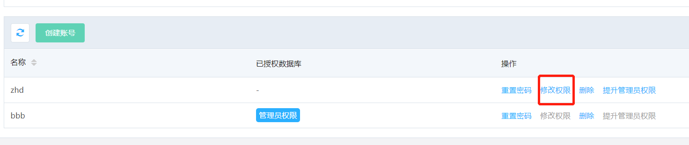
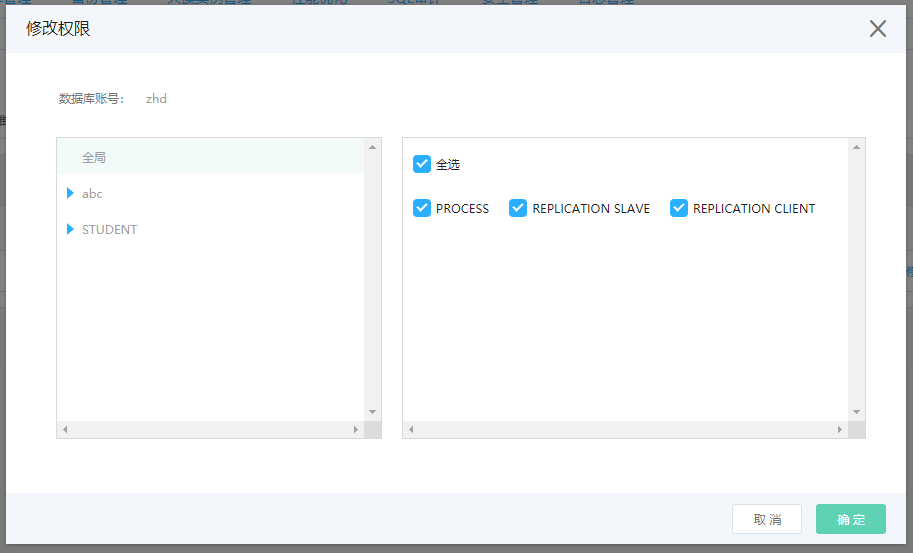

# 修改权限

## 操作步骤
1. 进入实例列表页，点击实例名，进入实例页面，选择 **账号管理** 页面，点击 **修改权限**

  

2. 在弹出的 **修改权限** 对话框中，修改指定用户的权限

 * 添加授权数据库，单击选中可授权数据库列表中的库名，点击中间按钮 “>”，选中的库名会从可授权数据库列表中移除，添加到已授权数据库列表的末端，默认选中权限 只读。
 * 移除授权数据库，单击选中已授权数据库列表中的库名，点击中间按钮 “<”，选中的库名会从已授权数据库列表中移除，添加到可授权数据库列表的末端。
 * 批量修改已授权数据库的权限，将鼠标移入 **批量操作** ，选择下拉菜单中的某一个选项，会将已授权数据库列表中的库权限全部改为相应的选择项。
        
        

实例支持的库表权限信息如下：

   |类型|权限|
   |-|-|
   |  库  |ALL、EVENT、EXECUTE、GRANT OPTION、LOCK TABLES、REFERENCES、ALTER、CREATE VIEW、CREATE、DELETE、DROP、INDEX、INSERT、SELECT、SHOW VIEW、TRIGGER、PDATE、ALTER ROUTINE、CREATE TEMPORARY TABLES、CREATE ROUTINE、PROCESS、SHOW DATABASES、REPLICATION SLAVE、REPLICATION CLIENT|
   |  表  |ALL、ALTER、CREATE VIEW、CREATE、DELETE、DROP、INDEX、INSERT、REFERENCES、SELECT、SHOW VIEW、TRIGGER、UPDATE|
   

