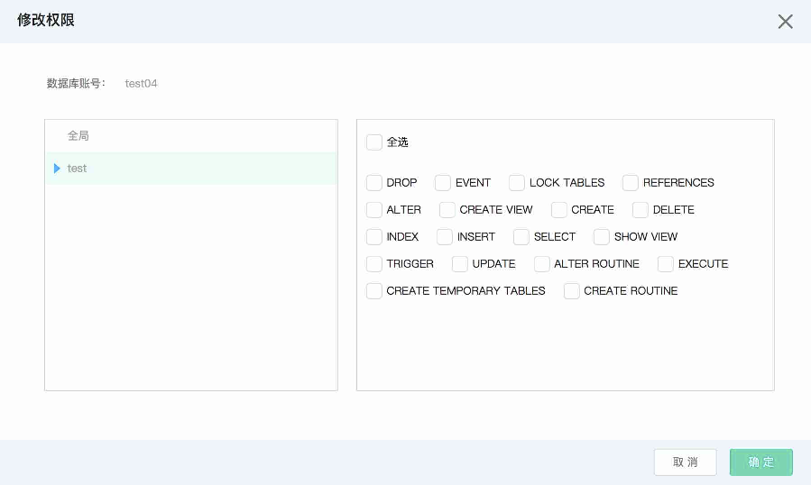

# 修改权限

## 操作步骤
1. 进入实例列表页，点击实例名，进入实例页面，选择 **账号管理** 页面，点击 **修改权限**

2. 在弹出的 **修改权限** 对话框中，修改指定用户的权限
* 全局权限：拥有实例下所有数据库的所有权限，您可以自定义选择实例支持的全局权限。
* 库表权限：配置实例下指定数据库表的权限，您可以为库表定义细粒度的权限.

实例支持的库表权限信息如下：

|类型|权限|
|-|-|
|  库  |ALL、EVENT、EXECUTE、GRANT OPTION、LOCK TABLES、REFERENCES、ALTER、CREATE VIEW、CREATE、DELETE、DROP、INDEX、INSERT、SELECT、SHOW VIEW、TRIGGER、PDATE、ALTER ROUTINE、CREATE TEMPORARY TABLES、CREATE ROUTINE、PROCESS、SHOW DATABASES、REPLICATION SLAVE、REPLICATION CLIENT|
|  表  |ALL、ALTER、CREATE VIEW、CREATE、DELETE、DROP、INDEX、INSERT、REFERENCES、SELECT、SHOW VIEW、TRIGGER、UPDATE|

