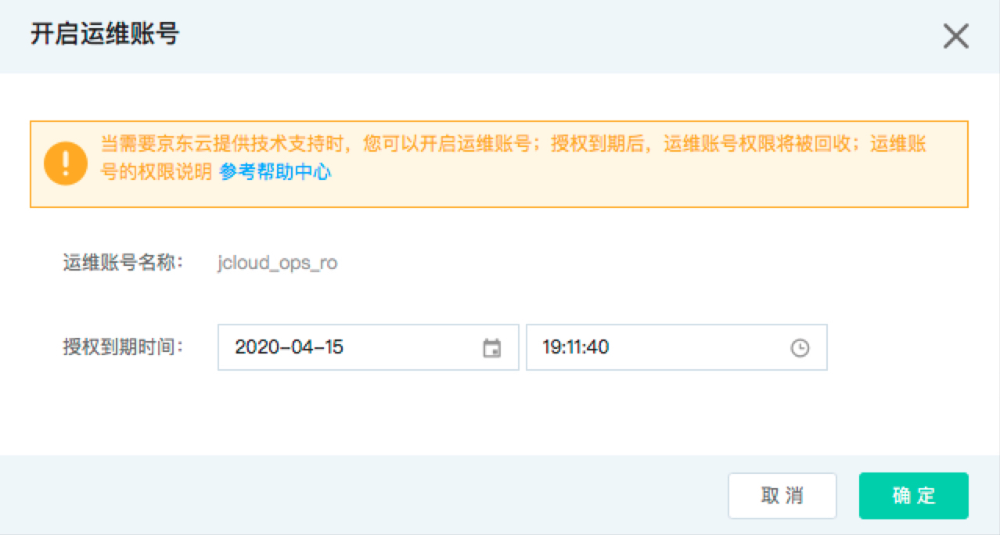
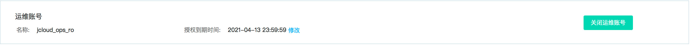
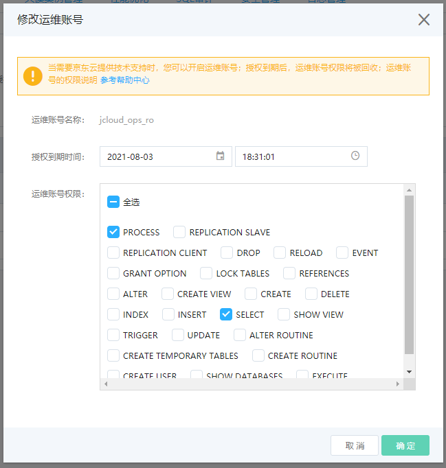
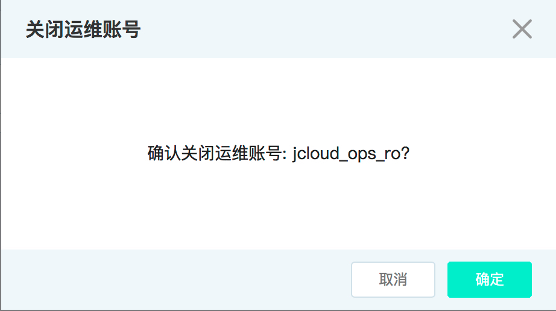

# 运维账号
如果在使用数据库过程中需要京东云提供技术支持,并且需要对您的实例进行操作，您可以创建临时运维账号提供给技术支持人员用于问题排查。
临时运维账号默认授予全局Select、Process权限，且账号只能通过控制台或者OpenAPI进行创建、删除以及对账号授权等，用户不能通过SQL语句对账号进行相关操作。

## 使用限制
* 一个实例仅支持一个运维账号
* 目前运维账号有效期必须大于当前系统时间，最长支持一年
* 运维账号适用于MySQL、Percona、mariaDB

## 开启运维账号
1. 登录 [云数据库 RDS 控制台](https://rds-console.jdcloud.com/database)。
2. 选择需要开启运维账号的目标实例，进入实例详情页。
3. 选择 **账号管理** 标签，打开账号管理页面，点击 **开启运维账号** 按钮，在弹框中设置运维账号到期时间:
    * 账号有效期默认为24小时，可根据实际需求调整；

    

4. 单击 **确定** 按钮，开启运维账号，返回到账号管理页面。

    

## 修改运维账号有效期
1. 登录 [云数据库 RDS 控制台](https://rds-console.jdcloud.com/database)。
2. 选择需要修改运维账号有效期的目标实例，点击目标实例，进入实例详情页。
3. 选择 **账号管理** 标签，打开账号管理页面，点击 **修改** 按钮，在弹框中重新设置运维账号到期时间。

    

4. 单击 **确定** 按钮，运维账号有效期被重新设置，返回到账号管理页面。

## 关闭运维账号
1. 登录 [云数据库 RDS 控制台](https://rds-console.jdcloud.com/database)。
2. 选择需要关闭运维账号的目标实例，进入实例详情页。
3. 选择 **账号管理** 标签，打开账号管理页面，点击 **关闭运维账号** 按钮，进入开二次确认弹窗。

    

4. 单击 **确定** 按钮，关闭运维账号，返回到账号管理页面。

