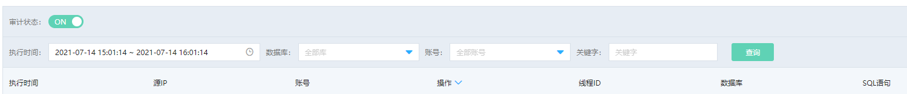

# Percona 审计服务
云数据库 Percona 开启日志审计后，会统计所有 DML 和 DDL 操作信息。
SQL 审计不会解析实际的参数值，并且在 SQL 查询量较大的时候会丢失少量的记录。因此通过这种方式来统计准确的增量数据可能会出现不准确的情况。

## 注意事项
* 默认 SQL 审计功能关闭，需手动开启

## 开启/关闭审计
1. 登录[云数据库 RDS 管理控制台](https://rds-console.jdcloud.com/database)。  
2. 选择需要查询 SQL 审计的目标实例，点击目标实例， 进入实例详情页，切换至 **SQL 审计** Tab 页。
3. 点击 **开关** 按钮，开启/关闭SQL审计。

## 查看审计
1. 登录[云数据库 RDS 管理控制台](https://rds-console.jdcloud.com/database)。  
2. 选择需要查询 SQL 审计的目标实例，点击目标实例， 进入实例详情页，切换至 **SQL 审计** Tab 页，SQL 审计查询功能说明如下。  
    * 执行时间：可以选择从当前时间点起向前推 36 小时的时间区间，作为 SQL 审计查询的时间段。例如：当前时间点为2021年7月5日18:35:35，用户最多可到处的审计时间区间为：2021年7月2日18:35:35~2021年7月5日18:35:35
    * 数据库：可以查看指定数据库的 SQL 语句。
    * 账号：可以查看指定账号的 SQL 语句。

    

3. 点击 **查询** 按钮，查看符合要求的 SQL 列表。
