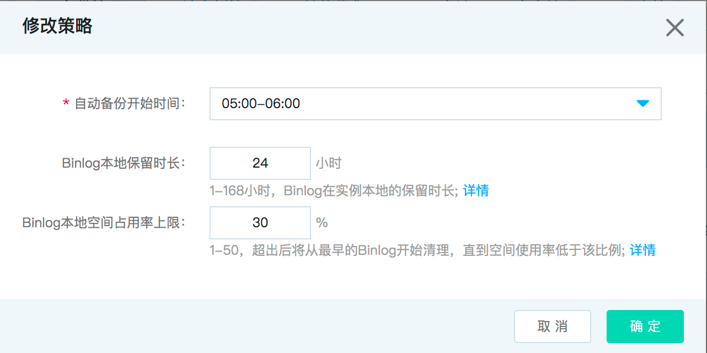

# 备份策略
云数据库 MySQL 实例支持自动备份和手动备份。自动备份需设置备份开始时间。

## 注意事项
* 请确保在业务低峰期进行自动备份。
* 自动备份：每天备份，备份保留7天。
* 只读实例不支持备份设置。

## 修改备份策略
1. 登录 [云数据库 RDS 控制台](https://rds-console.jdcloud.com/database)。
2. 选择需要进行设置自动备份策略的目标实例，点击目标实例的名称，进入到实例详情页。
3. 选择 **备份管理** 标签，点击 **备份策略** 标签进入实例备份策略的详情页，点击 **修改策略** 按钮，修改备份策略弹出框参数说明如下： 

|参数|说明|
|--|--|
|自动备份开始时间|选择数据备份的开始时间段，系统会自动在这个时间段的任意时间点执行备份操作。|
|Binlog本地保留时长|&bull; 可设置时间范围：1-168小时，默认保留时长为24小时 &bull; 超过设置的本地binlog保留时长后binlog会被自动清理|
|Binlog本地空间占用率上限|&bull; 输入范围：1-50% &bull; 当Binlog占用空间百分比超过阈值时，会将历史最远Binlog逐步删除直至Binlog占用空间低于设置阈值|
    
4. 点击 **确定** 按钮，完成备份策略的修改。

    

