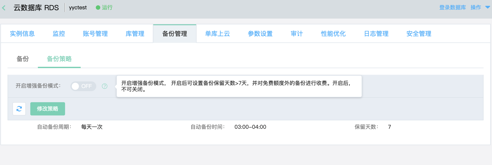
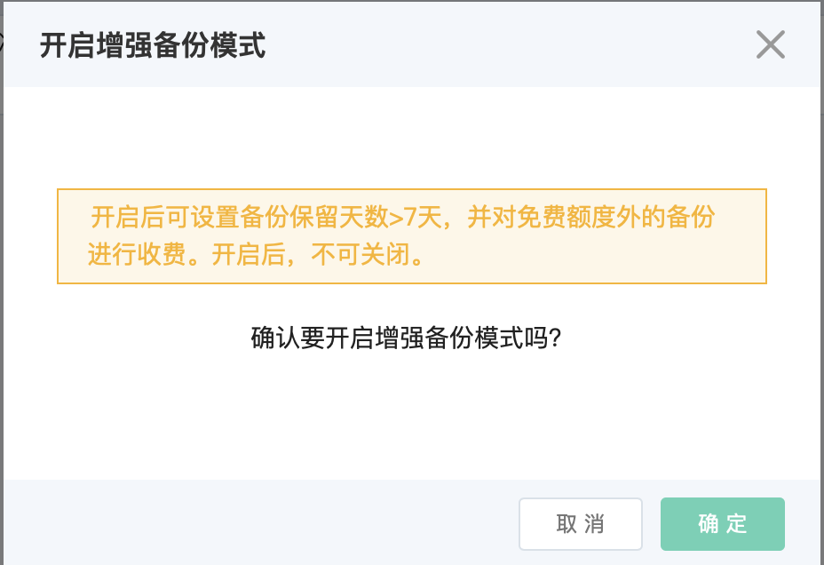
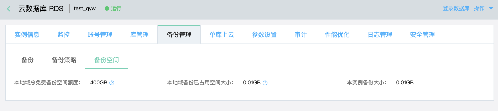

# 备份策略
可以查看和修改RDS SQL Server实例的备份策略。SQL Server每天会在定义的时间段中开始自动备份，备份免费保存7天。超出7天的自动备份将被清除。
> 注意：由于备份时会占用一定的CPU和IO资源，因此请尽量在业务低峰期进行自动备份

## 1. 操作入口
进入到“实例详情”的“备份管理页面，可以看到当前实例的备份策略

## 2. 修改备份策略
- 点击 **修改策略**，在弹出的对话框中修改各个备份策略项
- 当前仅支持修改 **自动备份时间**。 系统自动会在这个时间段内的任意时间点开始执行备份操作；由于备份的时间会根据实例的数据量的增加而增加，所以不确保在指定时间段内可以完成备份操作。

# 增强备份模式

用户可在控制台上开启增强备份，开启后可自行调整备份保留时长，且切换该实例的备份计费方式

## 前提条件
- 已经开通云数据库 RDS 权限
- 有计费信息，且不欠费
- 非中间态
  
## 计费方式
 按备份空间的实际使用量 扣除一定的免费空间额度后，进行计费

 详细价格信息见[SQL Server价格](urlhttps://docs.jdcloud.com/cn/rds/sql-server-price)

## 操作步骤
- 在备份管理-备份策略中操作，无其他入口

- 鼠标移到问号显示提示信息：开启增强备份模式， 开启后可设置备份保留天数>7天，并对免费额度外的备份进行收费。开启后，不可关闭

  

- 点击 **开关** 按钮，开启增强备份模式，跳出确认窗口如下：

  

- 确认开启后，备份管理下新增备份空间标签页，显示以下信息：

  1.本地域总免费备份空间额度（所有开启增强备份模式的实例可共享该免费额度）

  2.本地域备份已占用空间大小

  3.本实例备份大小

  

