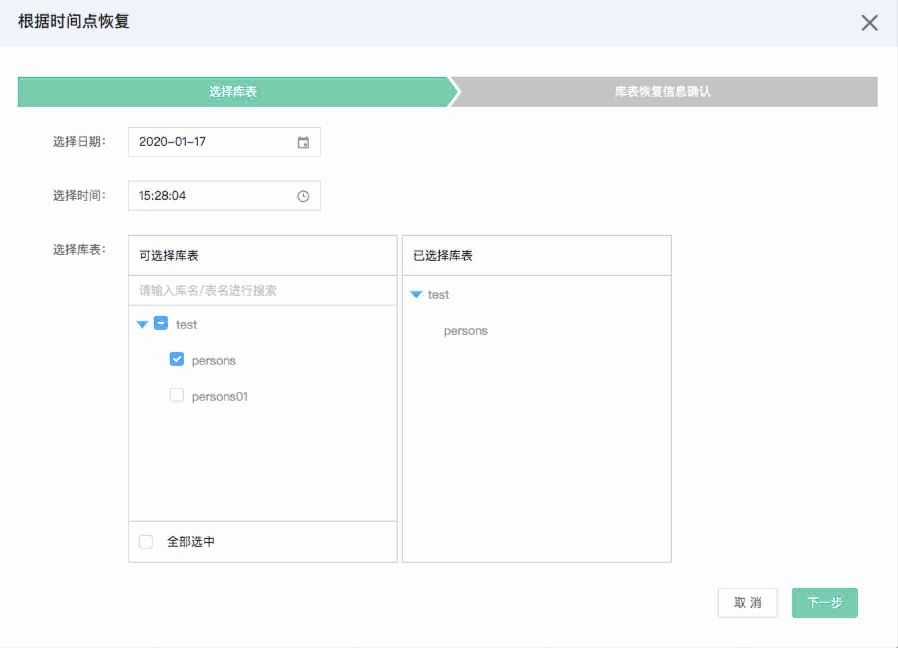

# MySQL 根据时间点创建实例
在使用云数据库实例的过程中，如果由于软件异常或者某种突发情况导致云数据库实例中的数据出现了脏数据的情况，然后你想恢复到之前某一个时刻的数据的话，就可以通过使用根据时间点恢复，恢复出一个新的云数据库实例，对数据库或表进行实时数据恢复。

## 前提条件
* 已经开通云数据库 RDS 权限。
* 实例状态为运行。

## 注意事项 
* 基于数据备份和日志备份（binlog）进行数据恢复。
* 数据恢复将在实例中增加新的数据库或表，原库和表的数据不变且仍然可见。

## 操作步骤
1. 登录 [云数据库 RDS 控制台](https://rds-console.jdcloud.com/database) 。
2. 在实例列表页， 选择需要根据时间点创恢复，进入根据时间点恢复弹窗。
3. 实例配置的参数说明如下：

* 选择日期：可以选择最近前 7 天的任意一天，但是不能早于目标实例的创建日期，具体以控制台为准。
* 选择时间：如果日期和目标实例的创建时间是同一天，那么只能选择创建时间以后的时间点，具体以控制台为准。
* 选择库表：在可选择库表中选择一个或者全部库表。

4. 点击 下一步 进入库表恢复信息确认页面，您可重新修改恢复后的表名称。

* 注：表名称只支持数字、小写字母、英文中划线和下划线

5. 点击确定后，弹窗自动关闭，实例进入恢复中状态，恢复完成后您可以登录数据库查询恢复后的库表信息。