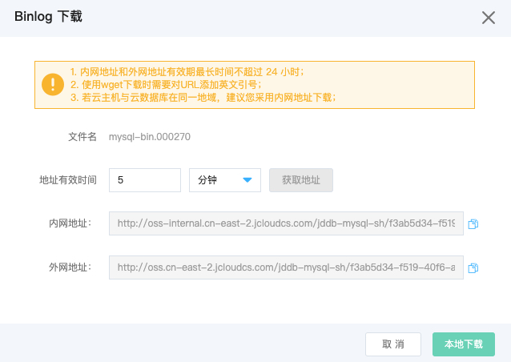

# Binlog 文件下载
当您想获取云数据库 MySQL/Percona/MariaDB 实例的 Binlog 文件的时候，京东云提供了内网地址，外网地址供用户自行下载。

## 注意事项
* 内网地址，外网地址是有有效期的，如果超过了有效期地址会失效
* 需要点击下载按钮，才能生成下载弹出框，才能获取新地址。

## Binlog 下载 
1. 登录 [云数据库 RDS 控制台](https://rds-console.jdcloud.com/database)。
2. 选择需要进行 Binlog 文件下载的目标实例，点击目标实例的名称，进入到实例详情页。
3. 选择 **备份管理** 标签，点击 **Binlog** 标签进入 Binlog 的列表页，选择你要下载的 Binlog 文件，点击 **操作** 这一列的 **下载**。

|参数|说明|
|--|--|
|地址有效期|支持设置地址有效期，有效期最长不超过24小时|
|内网地址|提供内网访问的域名，支持在同一个VPC下的资源进行下载备份，速度更快|
|外网地址|提供公网访问的域名，可以通过互联网下载备份数据，下载速度受限于公网的网络带宽，所以如果公网网络带宽太小且备份文件太大，下载时间会比较长。|
 


## Binlog 解压
> 京东云针对 Binlog 文件进行了压缩处理，所以下载到本地之后，需要先进行解压操作，才能通过标准工具进行 Binlog 文件解析。
> 
> * 备份的解压软件只支持在 Linux 下执行。
> * 解压工具的系统软件依赖：openssl gzip tee，python 版本 >= 2.7。


1. 下载备份的解压工具，[点击下载](https://jddb-common-public.oss.cn-north-1.jcloudcs.com/general_mysql_backup_extract_tool.zip)，并解压，工具名 mysql_backup_extract.py，使用示例如下：

  ```SQL
   # 增加解压工具文件可执行权限
    chmod mysql_backup_extract.py +x
    
   # 查看帮助手册
   python mysql_backup_extract.py -h
 
   # 解压实例的 Binlog 文件
   python mysql_backup_extract.py  -f [需要解压的 binlog 文件名] 
   ```
