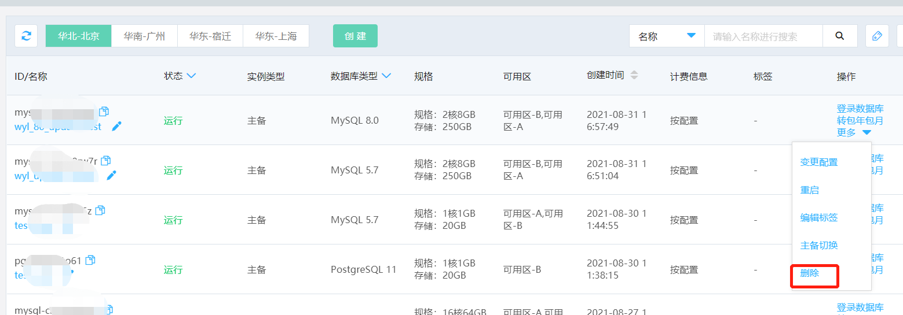
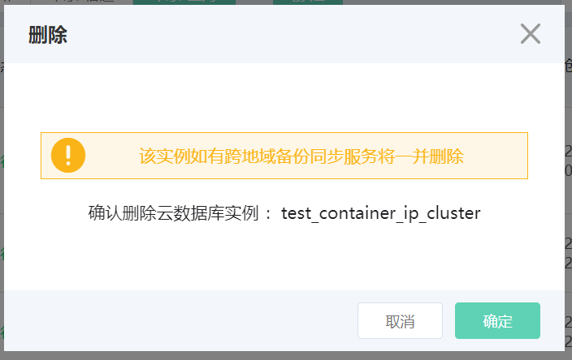

# 删除 RDS 实例

根据业务需求变化，您可以手动删除计费类型为 **按配置** 的实例，包年包月实例不支持删除操作。

## 注意事项
1. 当实例状态为 **运行** 状态时，才可进行 **删除** 操作。
2. 删除实例同步删除其关联资源，包括只读实例、备份、跨地域备份同步服务等。

## 1. 操作入口
实例列表页面会显示当前区域下的各个实例的概要信息。点击实例最右边的 **更多** 按钮。

## 2. 确认删除
点击 **确认** 进行删除.

>注意：如果该实例配置了跨地域备份同步服务，那么该服务也将同时被删除。

