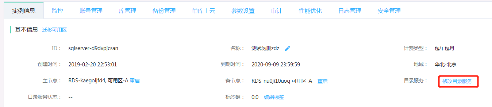
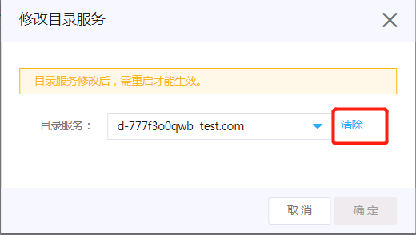

# 配置目录服务（Active Directory)
支持在SQL Server中配置云端的目录服务（Active Directory），通过AD对SQL Server的账号和权限进行管理

# 操作步骤
## 加入域
1. 首先需要在跟云数据库 SQL Server相同的地域和VPC中创建目录服务，具体操作步骤可查看目录服务的相关[文档](https://docs.jdcloud.com/cn/driectory-service/create-instance)
2. 进入到SQL Server **实例信息**的页面中，点击**修改目录服务**

3. 在弹出的窗口中选择要接入的目录服务，然后点击 **确定** 按钮。

4. 可以看到 **目录服务状态** 是 **加域中** ，稍等几分钟等状态变为 **已加域** 后，目录服务修改成功。

## 删除域
在上述第三步的弹窗中，点击 **清除**，将目录服务下拉框置空，然后点击 **确定**

