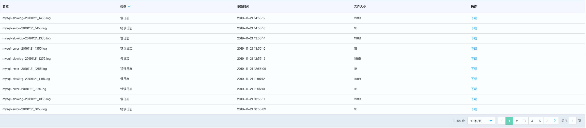

# MariaDB 日志管理
京东云云数据库 MariaDB 提供了原始的实例日志，方便您使用现成的工具进行日志分析，进行应用程序的排错、优化。

云数据库 MariaDB 实例每 5 分钟会自动同步最新的实例日志文件至云存储, 每一小时或者单文件大小超过 128MB 会新生成一个日志文件。

## 注意事项
* 日志管理只会显示错误日志，慢日志。
* 目前京东云暂不收取错误日志，慢日志所产生的存储空间占用费用。

## 查看已经上传云存储的日志文件
1. 进入 [云数据库 RDS 控制台](https://rds-console.jdcloud.com/database)。
2. 选择需要查看原始错误日志，慢日志文件的目标实例，点击目标实例的名称，进入到实例详情页。
3. 选择 **日志管理** 标签，就能看到已经上传到云存储的错误日志、慢日志文件。

