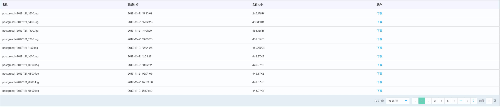

# PostgreSQL 日志管理
京东云云数据库 PostgreSQL 提供了详细的实例日志，您可以根据日志信息进行应用程序的排错、优化。

## 注意事项
* 默认情况下日志文件只会记录错误日志，慢查询日志，如果要开启 SQL 审计，可以通过修改参数组参数实现。
* SQL 查询记录为慢查询由参数组参数 **log_min_duration_statement** 控制，目前默认是 1 s。
* SQL 审计默认是关闭的，如果需要打开可以通过修改参数组参数 **pgaudit.log** 值实现。
* 目前京东云暂不收取日志文件所产生的存储空间占用费用。

## 查看已经上传云存储的日志文件
1. 进入 [云数据库 RDS 控制台](https://rds-console.jdcloud.com/database)。
2. 选择需要查看日志文件的目标实例，点击目标实例的名称，进入到实例详情页。
3. 选择 **日志管理** 标签，就能看到已经上传到云存储的错误日志、慢日志文件。

